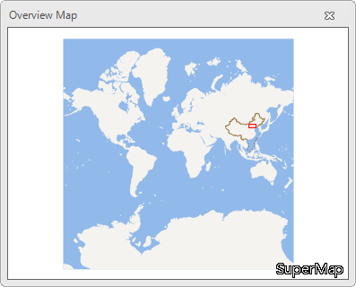
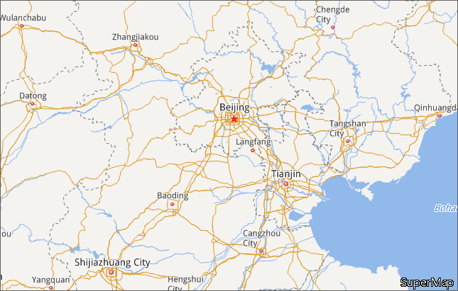

### Introduction

The overview map is the thumbnail of the display area of the map, which is used to display position of the current map window in the entire map. Users can change the display area of the current map through dragging the rectangle of the overview map.

### Basic Steps

  1. On the Map tab, in the Browse group, click Overview Map.
  2. The Overview Map displays the thumbnail of the entire map by default. The red rectangle represents the display area of the current map window. Users can drag the rectangle box to change the position the current map displays.
  3. Meanwhile, when users can pan, zoom in, zoom out in the map, the rectangle box will also change. 

 |   
---|---  
The Overview Map dialog box | Contents displayed in the Map  

### Note

  * While dragging the rectangle box in the Overview map, the prompt information Map exceeds display bounds will display and the red rectangle will not display.