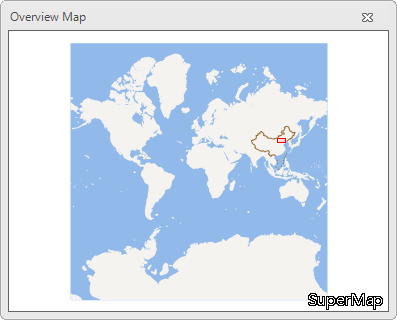

A hawkeye map is the thumbnail of the display area of a map. It is used to
display position of the current map window in the entire map. You can change
the display content of the current map through dragging the rectangle on the
hawkeye map.

**Function Entrances** : **Map** > **Browse** > **Hawkeye**.

### Introduction

The Overview Map displays the thumbnail of the entire map by default. The red
rectangle represents the display area of the current map window. You can drag
the rectangle box to change the display content in the current map window.
Meanwhile, when you pan, zoom in, zoom out your map, the rectangle box will
also change.

  
  
### Note

  * While dragging the rectangle box in the Overview map, the prompt information "Map exceeds display bounds" will pop up with the red rectangle disappearing.

