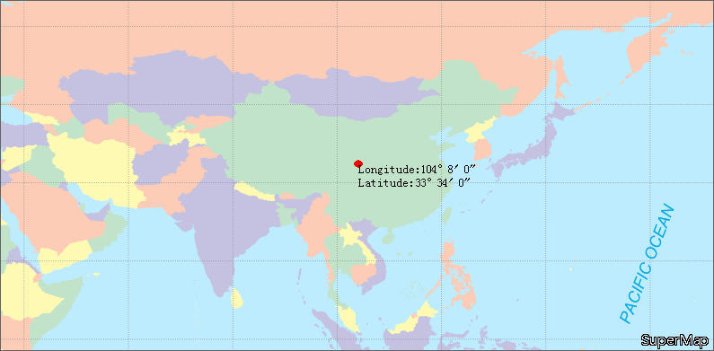

### Introduction

The Go to XY button provides the function of locating to a certain coordinate point in the map. You can directly input the coordinates to locate the point with a red circle. Meanwhile, you can add coordinate annotation for the point.

### Basic Steps

  1. On the Map tab, in the Browse group, click Map Location to display the Map Location dialog box.
  2. The coordinates of the center point of the current map window will display in the dialog box, and the unit is consistent with the current map. If you input coordinates in the dialog box and click Locate or press Enter, the point indicated by the input coordinates will be located and the point will be marked with twinkling red point in the current map window.
  3. If the current map is a geographic coordinate system, you can check Display as DMS check box to change the coordinate input box to degrees: minutes: seconds.
  4. If you check Add Label, coordinate annotation will be added. 
  5. Location and annotation results are shown as follows:  
  
    
Figure: Location and annotation result.  

### Note

  * If the location point is not in the display bounds of the current map window, the located map window will be switched to view display with the point being the center point. If the location point is in the display bounds of the current map window, the display bounds of the current map window will not change.
  * If the red annotation point does not display after location, it is hided by the Map Location dialog box. You can move or close the dialog box to see the annotation point.