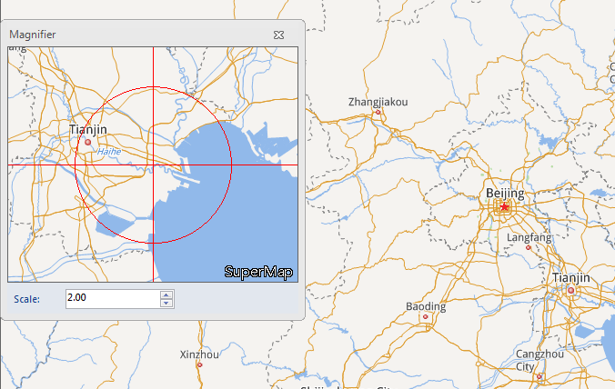

Map Magnifier means adding contents in the map window to the Magnifier window,
and display the the map contents at times of the magnifier. Contents the
Magnifier window displays will change according to the mouse move in the map
window. Meanwhile, the cross of the magnifier will move with the mouse move
and will be at the position consistent with the mouse position.

**Function Entrances** : **Map** tab > **Browse** > **Map Magnifier**.

### Instruction

  1. The Magnifier window take the mouse position as the center to display your map. The contents displayed in the window change over the moving of your mouse.
  2. Set Zoom Scale in the Magnifier window to change the times for scaling of the contents in the Magnifier window.
  
