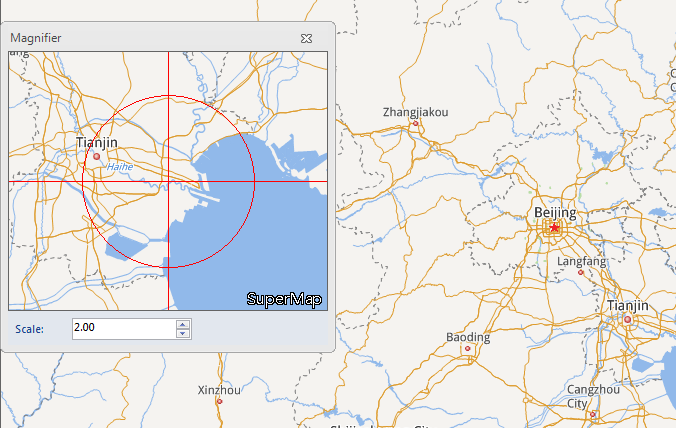

### Introduction

Map Magnifier means adding contents in the map window to the Magnifier window, and display the the map contents at times of the magnifier. Contents the Magnifier window displays will change according to the mouse move in the map window. Meanwhile, the cross of the magnifier will move with the mouse move and will be at the position consistent with the mouse position.

### Basic Steps

  1. On the Map tab, in the Browse group, click Magnifier to display the Magnifier dialog box.
  2. The Magnifier window displays the map with the mouse position being the center. The contents in the map window change according to the mouse move in the map.
  3. Set Zoom Scale in the Magnifier window to change the times for scaling of the contents in the Magnifier window.
  
The Magnifier window  