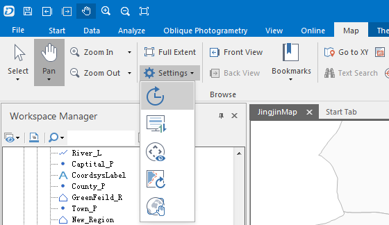

The map browsing settings provides refresh, automatic scroll, navigation bar, global pan, etc.

From the drop-down list, the icon in gray means this function is selected. If you want to stop the function, re-choose this function, so that the function will be unselected.

  
Figure: Setting Items From Drop-down List  
  
### Wheel Delayed Refresh

Wheel Delayed Refresh is used to control whether the map refresh will be delayed as you zoom the map by your mouse. If this function is enabled, the entire map will refresh after 0.4 second of your mouse operation. When you zoom the map with massive data and you don't enable this function, the real-time map refresh will slow down the map display. In order to optimize the effect, we suggest you enable this function. By default, this function is enabled.

### Automatic Scroll

When you pan your map to see the part beyond your current screen but you also don't want to switch the map operation status into the map pan status, you can select Automatic Scroll, in this case, your map will auto pan at a time when your mouse pointer close to the screen bounds and click once.

**Note:** The Automatic Scroll is unavailable when the operation status is zoom in, zoom out, zoom and pan.

### Show Navigation Bar

Click on Show Navigation Bar. There will be a navigation bar displayed on the right of the map window. The navigation bar includes a wheel above and a slider below. The wheel controls the map panning way, including pan up, pan down, left pan, and right pan. The slider controls the resolution of the map. The map can be zooming in or out when you slide the slider.

### Partly Refresh

The Partly Refresh only refreshes part of the map when you zoom your map. This function ensures the map browsing smooth, reduces user waiting time. It is very significant when you browse a very big data of the map.

### Global Pan

Global Pan aims at seamlessly panning the world map even when you confront with the bounds of east hemisphere and west hemisphere. The user experience for the planar world is the same to the spheric world. When Global Pan enables, the bounds of the world map are not limited to the ranges of longitude -180 to +180. However, the bounds change smartly according to the mouse position changes.

The global pan requires special reference coordinate systems. Currently, it supports WGS 1984 and World Mercator.

**Note:** When you create thematic maps and enable the flow display function, you are not allowed to use part refresh, otherwise the result will be not correct. Currently, label map, graph map and gradual map have flow display function.