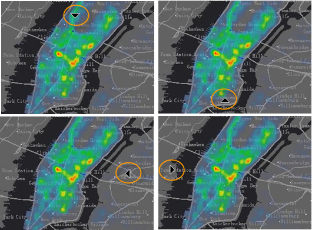
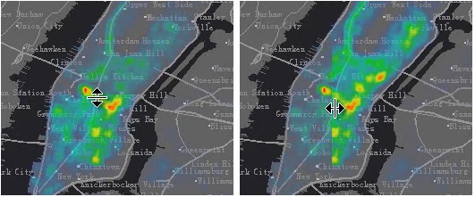

### Introduction

The Map Swipe function is usually used for remote sensing image browsing operation. Generally, we use the map swipe operation to view the differences of two images. The map swipe operation can monitor the effect of pulling up or down, left or right an upper level image, so that the lower level image can display or be hidden. Now, the map swipe operation can be applied not only to the image, but also to other layers in the map, such as the demo dynamic diagram below, a raster layer is superimposed on the vector map, and a map swipe operation is operated on the grid layer.

### Application Scenario

Map swipe can be applied to the following scenarios:

  1. Multi-temporal remote sensing images to see the differences in different phases;
  2. Multi-version cache to see the differences between different cache data in the same area;
  3. Vector layers, especially administrative boundaries, to view changes in the boundaries;

The swipe layer can be any vector layer, grid layer, image layer, cache layer, and the swipe layer can also be a group of layers.

### Basic Steps

  1. Open the target map.
  2. On Map tab, in the Map Swipe group, click "Swipe" to open "Map Swipe" dialog box where you can do settings of swiping, twinkling and gradient. 
  3. Choose a layer or layer group from Select Layer drop-down list. You can choose any layer or layer group. However, you cannot choose a layer in a layer group.
  4. Click Swipe button. When the button is on, the map swipe function is activated. When you move your mouse to the map, the mouse becomes an arrow. According to the position of the mouse in the map, the directions of the arrow will be different, and the directions for map swipe will be different, as shown below:

  
Figure: Different mouse status  

  5. After you switch to map swipe, you can press your mouse and pull up or down, left or right for map swipe. Icons for the mouse will different for up down swipe and left right swipe.

  
Figure: Mouse status icon  

  6. If you want to cancel map swipe operation, you can press the Swipe button again. When the button is off, the swipe function will be deactivated. You can also right click in the map window to deactivate map swipe operation.
  7. Map swipe operation is demonstrated as shown below:
  

### Tips

  * When the current map window is in swipe status, the swipe layer will be hidden when you hold down the Ctrl key while pressing the left mouse button. The swipe layer will display when you release the left mouse button.
  * When the current map window is in map swipe status, the swipe layer and all layers with display order above the swipe layer will participate in the swipe browsing operation.