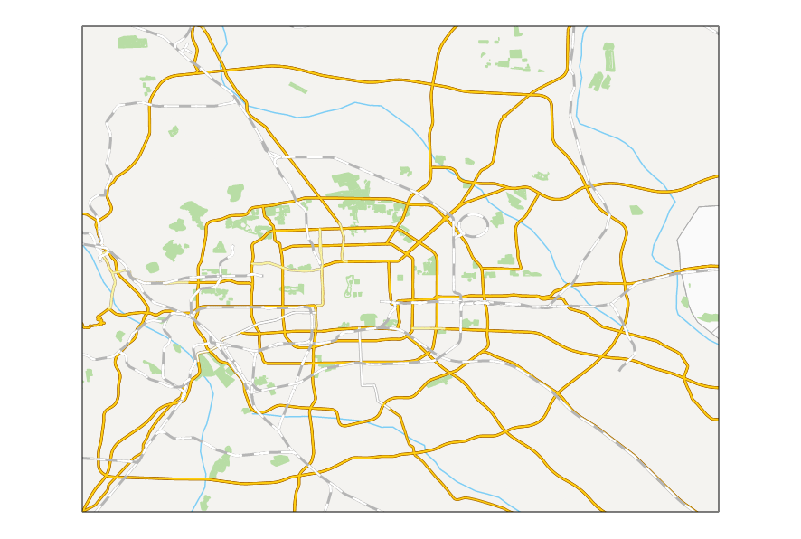

You can make your map swipe or blink. This article introduces the two features.

* **Swipe**

It is usually used for browsing remote sensing images. Generally, we use the
feature to check the differences between two images. The feature can pull up
or down, left or right an upper level image, so that the lower level image can
be visible or invisible increasingly. The feature can work on not only image
data, but also other layers in the map. As the demo dynamic diagram below
shows, a raster layer is superimposed on the vector map. Enable the feature on
the raster layer.

The swipe layer to be pulled can be an image layer, raster layer, image layer, or cache layer. Or, you can select a layer group as a swipe layer. 

**Note** : When you enable an swiping operation, it is not suggested that you add a new layer on your map. Because the new layer can't be shown instantly.

* **Twinkle**

The feature can dispaly and hide a specified map swipe layer, hiding the swipe
layer at specified intervals. It can be used for comparing historical data and
current data.

### Application Samples

* Multi-temporal remote sensing images to see the differences in different phases;
* Multi-version tiles to see the differences between different tile data in the same area;
* Vector layers, especially for administrative boundaries, to view changes in the boundaries;

###  Function Entrances

**Maps** tab > **Map Swipe** group > **Swipe**.

### Basic Steps

  1. In the **Map Swipe** dialog box, specify the layer or the layer group you want to pull. Notice, you are not allowed to select a layer that is located in a layer group.
  2. Click **Swipe** button in the dialog box, and then you can pull the swipe layer in the map window. The pulling direction follows your mouse position.
  

  3. Press your mouse and move it to pull the swipe layer. Icons of the mouse are different for different pulling direction. You can observe the mouse icon on your map to know about the pulling direction.
  

  4. Click on the **Stop** button in the **Map Swipe** dialog box. You can also right click in the map window to deactivate the operation.
  5. Map swipe operation is demonstrated as shown below:
  

  
### Tips

  * When enabling the feature and holding the Ctrl key down, you can display or hide the swipe layer by holding or releasing the left key of your mosue.
  * When enabling the feature and holding the Shift key down, the layer you specified and other layers above the layer will involve in the swiping operation as a swipe layer.

### Twinkle

  1. In the **Map Swipe** dialog box specify the layer or the layer group you want. You can not specify a layer that is saved in a layer group.
  2. Set a time interval. Its unit is millisecond.
  3. Click on the **Blink** button.
  

