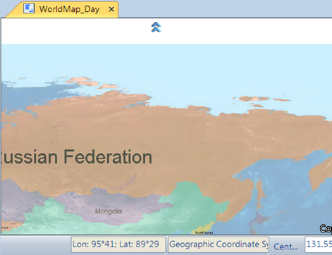

When the user operates in the map window, the automatic scroll function can enable if you want to pan the map to view the map part that is not displayed in the map window and is not convenient to switch the operation status in the map window to the pan map state.

### Basic steps

1. On the Browse group in the Map tab, click Settings drop-down button and select Automatic Scroll.
2. Check the box to automatically set the map in pan mode when the boundary of the work area is reached, as shown in the left figure. Then you can click to scroll the map, as shown in the right figure.  

 |   
---|---  
Figure: Before auto scrolling | Figure: After auto scrolling  
  
When the map is in zoom in, zoom out, zoom free, and pan mode, the auto scroll
command is not active.