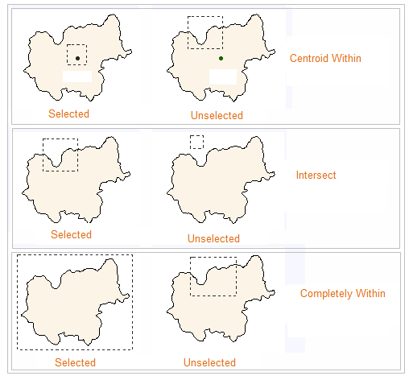

The **Select** feature organizes several methods for object selection. The
function entrance is: **Maps** tab > **Browse** group > **Select** drop-down
button.

**Note** : Please ensure your layer is selectable. You can select objects by:

### Ctrl+A: Select All

When a layer is selectable, and the mouse focuses on the map, you can click
**Ctrl + A** to select all objects in the layer.Click ESC to cancel the
selection.

### Select

Click the image part of the Select buttonDropDown to display the drop-down
list, click Select.

  * Select by clicking a point: Click a point to select an object in the layout window. The selected object will be unselected if you click to select another object. To select several objects at the same time, you need to hold down the Shift key.
  * Select by dragging a box: Hold down the left mouse key and drag a temporary box. The objects whose centroids are within the box will be selected. To select several objects, drag boxes while holding the Shift key.

### Dragging a circle

Select objects by dragging a circle. Click the image part of the Select
buttonDropDown to display the drop-down list, click Circle.

  * Click in the map window to specify the center of the temporary circle. Drag to draw the temporary circle.
  * Click again to finish the temporary circle. The objects whose centroids are within the circle will be selected.
  * To select several objects at the same time, draw circles while holding the Shift key.

### Drawing a polygon

Select objects by drawing a polygon. Click the image part of the Select
buttonDropDown to display the drop-down list, click Polygon.

  * Continuously click to draw a temporary polygon and right click to finish. The objects whose centroids are withing the polygon will be selected.
  * To select several objects at the same time, draw polygons while holding the Shift key.

### Drawing a polyline

Draw a polyline to select objects intersected with the polyline. Click the
image part of the Select buttonDropDown to display the drop-down list, click
Polyline.

  * Continuously click to draw a temporary polyline and right click to finish. The objects intersected with the polyline will be selected.
  * To select several objects at the same time, draw polylines while holding the Shift key.

You can mix the methods introduced above to select objects by holding down the
Shift key when selecting objects. Multi-layer selection is supported in
SuperMap iDesktop.

### Selection Mode

The Selection Mode provides three selection modes: Contain Centroid, Areas
Intersect, and Contain Object. The **Selection Mode** parameter is global. And
so the resulting mode will be saved in your computer.

  * **Contain Centroid** : When the object's centroid is included in the temporary rectangle, the object is selected.
  * **Areas Intersect** : The object is selected when there is an intersecting portion between the temporary rectangle and the object.
  * **Contain Object** : When the temporary rectangle contains the object completely, the included object is selected.

To extract the temporary rectangular box to select the object as an example,
the interpretation of the three object selection mode as shown below. The
dotted rectangle in the figure represents a temporary rectangle, and the
polygon represents a geometric object.

  
  
### Tolerance

Tolerance is mainly used to control the accuracy of the selected object, that
is, in the selection of objects, by setting a tolerance value, when the cursor
and the map object distance is less than the value (in pixels). The object is
selected. The user can enter the tolerance value directly in the text box.

### Interaction of selecting of multiple objects

When you select many objects at the same time, right click on the map window,
and if you hover your mouse over "Select Objects(Top 20)", you can view the
first 20 of all selected objects and layers where these objects are located
in. You can choose any object from the list as needed, and the system will
highlight it in the map.

