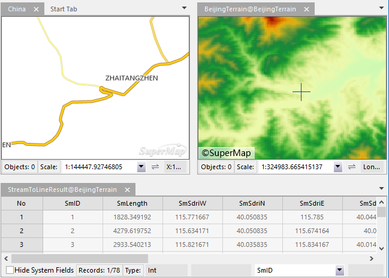

### Description

Opens multiple windows and dynamically link them so that operations in one window will accordingly be displayed in the other linked windows.

You can link map windows, scene windows, and attribute table windows. Window modes Tab, Extension all supports associated browsing.

### Basic Steps

Below we take two windows as an example to demonstrate to realize associated browsing.

1. Open two datasets depicting different themes of the same region in new map windows.
2. In general, the associated data are located in the same area, but the information of the data is different, so that you can view multiple data for a region by once browsing operation.
3. Click Associated Browsing in the Window group on the View tab.
      * **Select All** : Select all the windows in the list.
      * **Select Inverse** : Select inverse the windows in the list.
      * **OK** : Comfirm the parameters.
4. Click OK to browse.

  

5. You can zoom map in/out or other operations in one window and another window will accordingly change, and vice versa. When you do the operation to an attribute table, double click a record in the table, the corresponding object will be located in map window immediately.
6. When the new associated windows are created, the current associated relation is discharged automatically.

### Note

* When the current workspace has opened two or more maps, scenes or attribute tables, a window can't be associated.
* Window modes Tab, Cascade and Extension all supports associated browsing.
* Only a set of associated relationship can be saved in the current workspace.
* When conducting the associated browsing, the window orders are related to the opening orders.
* When conducting the associated browsing, the map window and the scene window will display side by side, if the property table window to participate in the association browsing, the property table window will be displayed by default in the lower half of the window
* The view range of the map shall not be changed when the most or all areas of the selected associated object are displaying in the current view range, the associated object will be merely highlighted, and minimizes the refresh times of map.
* When the attribute table window also involved in the association browsing, all the objects will not be highlighted in the map if you select whole column of the attribute table by default. If you want to highlight all objects, you can set the related parameters in the right-click menu of the attribute table.