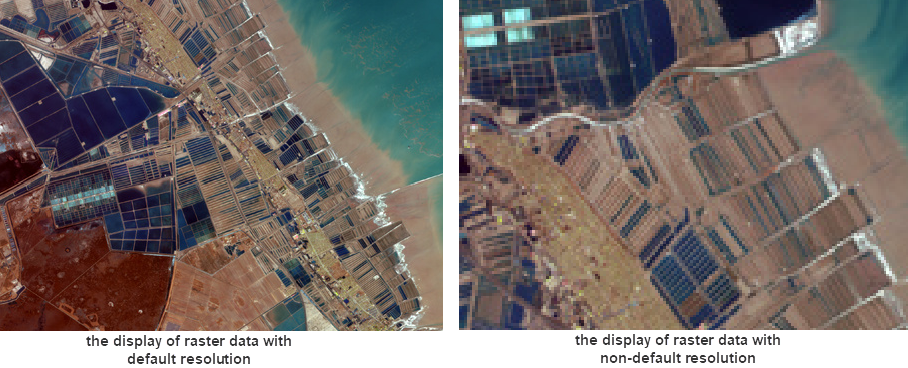

### Introduction

Zoom the raster image layer to the best display status.

Keep the center point of the map unchanged and adjusts the ratio of raster
image resolution to the monitor resolution to 1:1 (one pixel of the map window
corresponds with one cell of the raster/image data). You can't get a clearer
display even you zoom your layer. If your map includes other datasets apart
from the raster layer, the product will be display them with the same
resolution.

**Operation instruction** : Right-click on your raster layer in the layer
manager and select **Zoom to Current Image Resolution**. The program will
adjust the zooming scale according to the resolution of your layer.

  

