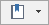

When you pan, zoom in, zoom out a map, the different contents displayed in the map window is called map views. The bookmark feature is used to save the view at some point, and you can conveniently see the view at any time.

### Instructions

There are two ways to open the "Add Bookmark" dialog box to create a bookmark.

  * In the "Browse" group of "Maps" tab, click on the "Bookmark" button.
  * In the map status bar, click the button .

Besides, all bookmarks you have created are listed in the Bookmark drop-down list. You can select any bookmark to show the map at the view status..

  * Add Bookmark: Adds a bookmark to record the current view of the map, in the meanwhile, you can give a name and description information to the bookmark. 

**Note** : Only one bookmark can be added for a map that map views are at the same scale with the same center.

  * Delete Bookmark: Deletes the selected bookmark.
  * Bookmark Manager: Manages the bookmarks.
  
The information for each bookmark, such as the name, type, and created date, is listed in the Bookmark Manager dialog box. Besides, the Bookmark Manager dialog box allows you to rename and delete bookmarks.

  * Rename: Select a bookmark, press F2 or click in the Name cell to set the name of the bookmark editable, type a new name and press Enter.
  * Delete: Select one or more bookmarks with the assistance of the Select All and Inverse commands provided on the toolbar of the dialog box.
* Move up/Move down: Select a bookmark, and click on this button can adjust its order.