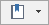
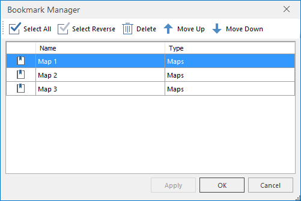

The Bookmark funtion organizes a series of operations including Add Bookmark, Delete Bookmark, and Bookmark Manager.

When you pan, zoom in, zoom out a map, the different contents displayed in the map window is called map views. The **Bookmark** function is used to save the view at some point, and you can conveniently see the view at any time.

### Instructions

There are two ways to open the "Add Bookmark" dialog box to create a bookmark.

* Maps > Bookmark to open the Add Bookmark dialog box.
* In the map status bar, click the button .

Besides, all created bookmarks are listed in the Bookmark drop-down list. You can select any bookmark to show the map at the view status..

* **Add Bookmark** : Adds a bookmark to record the current view of the map. In the meanwhile, you can give a name and description information to the bookmark. 

**Note** : Only one bookmark can be added for a map that map views are at the same scale with the same center.

* **Delete Bookmark** : Deletes the selected bookmark.
* **Bookmark Manager** : Manages the bookmarks.    
The information for each bookmark, such as the name, type, and created date, is listed in the Bookmark Manager dialog box. Besides, the Bookmark Manager dialog box allows you to rename and delete bookmarks.

* **Rename** : Select a bookmark first, and then press F2 or click in the Name cell to set the name of the bookmark editable. Type a new name and press Enter.
* **Delete** : Select one or more bookmarks with the assistance of the Select All and Inverse commands provided on the toolbar of the dialog box.
* **Move up/down** : Select a bookmark first and click on this button to adjust its order.

### Front View
When you pan, zoom in, zoom out a map, the extent displayed in the map window is map view. A bookmark is an item you create to to supply a name to the current map view. The Front View button allows you to go back to the map view recorded by the previous bookmark.

* Click the Front View button to go back to the map view recorded by the last bookmark.
* The button is only active if the previous bookmark exists.

Besides, you can Press F7 to go back to the previous bookmark.

### Next View

When you pan, zoom in, zoom out a map, the extent displayed in the map window is map view. A bookmark is an item you create to to supply a name to the current map view. The Back View button allows you to go forward to the map view recorded by the next bookmark.

* Click the Back View button to go forward to the map view recorded by the next bookmark.
* The button is only active if the next bookmark exists.

Besides, you can Press F8 to go forward to the next bookmark.