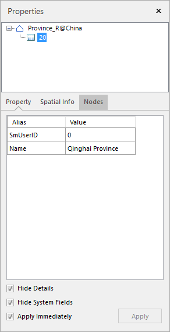
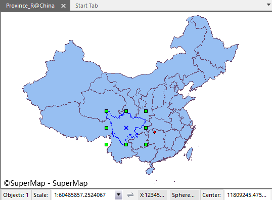

---
id: Geometry_Property
title: Modifying Properties of Geometry Objects
---  

### Introduction

Display the properties of the selected geometric objects.

### Basic Steps

  1. Select a geometric objects.
  2. Right click and click Properties in the context menu that shows up.
  3. The Properties window appears displaying the detailed information about the selected objects, including the general information, spatial information and node information.

 |   
---|---  
Figure: The Properties window | Figure: The map window  
  
### Note

  * The method to view the properties of the selected objects only apply to the case of selecting an object.
  * Only the properties of the text objects in the topmost layer will be displayed in the Properties window if you have selected text objects from different layers.

### Related Topics

[Properties Window for Objects in Vector Datasets](PropertyWinIntro.htm)