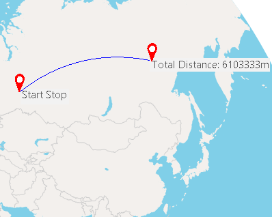
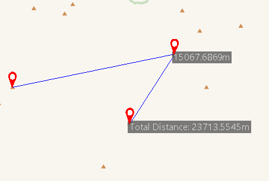
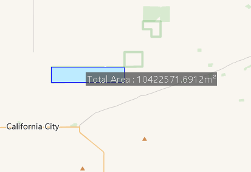
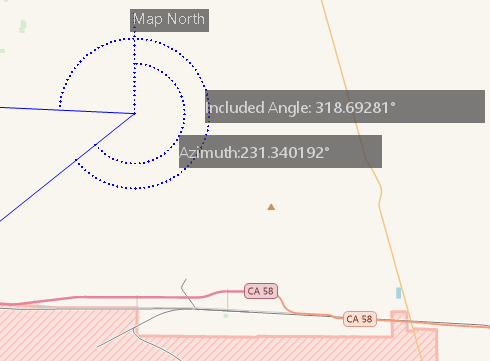

The function Map Measurement can measure distances, areas, and angles on a
map. You can turn off each object snap setting to snap to the location of
interest. You are allowed to press Ctrl Z to undo the last measurement. At the
same time, the product supports setting the measurement unit and clearing
measurement results.

**Note** : The function can not work on unreasonble polygons (like self-intersection).

### Unit

It is recommended to set the unit of measure before measuring. Click **Maps** > **Operation** group > **Unit** button to open the dialog box **Unit Settings** where you can set the unit of distance, area, or angle in the pop-up dialog box. If the Automatic Conversion Unit is checked, the result will be automatically converted. For example, if the current measurement unit is in decimeter and the result is greater than or equal to 10 decimeter, the result will be converted in units of meters. If the result is greater than or equal to 1000 meters, the result will be converted in kilometers. The same inch, feet, yards, miles will automatically convert.

### Function Entrances

**Maps** tab > **Operation** group > **Map Measurement**.

### Distance

The product supports calculating straight lines, geodetic lines, and raster surface distance.

* **Distance** : calculates the plane distance between two points in the map. 
* **Geodesic Distance** : calculates the geodetic distance between two points on the spheroid. You can use the feature to measure the geodesic distance between two airports to determine the airline.  
  

* [**Surface Distance**](../../Analyst/Raster/SurfaceAnalyst/SurfaceDistance) calculates the surface distance on raster data, that is to calculate the curved surface distance on the fitting 3D curved surface along the given line segment or polyline. The surface distance is bigger than both the straight distance and geodetic distance.

This article introduces how to measure the straight distance between two points. You can use the same way to calculate geodetic distance and surface distance.

  1. Click **Maps** > **Operation** group > **Map Measurement** dropDownButton > **Distance**.
  2. Left-click to specify the start point. When you move your mouse pointer away from the start point, a temporary line shows up.
  3. The product will display two values at the middle and end of the line. One value is the distance between the last point and the second last point. Another value is the total distance of all segments. 
  4. You can specify a set of points to get not only the distances between two adjacent points, but also the total distance.
  5. Right click to finish the measurement. The product will display the distance between any two adjacent points and the sum of all distances.
  

###  Measure Area

The product supports calculating the plane area or [surface
area](../../Analyst/Raster/SurfaceAnalyst/SurfaceArea) of an area you
draw on a raster dataset. Surface Area is the total surface area of the
simulated curved surface of the raster dataset.

  1. Click **Maps** > **Operation** group > **Map Measurement** dropDownButton > **Area**.
  2. Left-click to determine the first point, and then move your mouse to draw an temporary region.
  3. The product will show you the area of the region you draw instantly.
  4. Right click to finish the measurement. The area of the temporary polygon is displayed on the map as well as in the Output Window.
  

###  Measure Angle

  1. Click **Maps** > **Operation** group > **Map Measurement** dropDownButton > **Angle**.
  2. Click to specify the start point of one edge, and then a dotted line pointing to true north shows up. Move your mouse to form a temporary line. The product will show the angle (or the azimuth) between the dotted line and the temporary line.
  3. Click again to confirm the first edge, move the mouse pointer to specify the other edge. The azimuth of the second edge and the angle between the two edges are displayed on the map.
  4. Continuously click to measure included angles between edges and azimuths for all edges.
  5. Right click to finish measuring angles. Angles for each pair of connected edge are displayed around the junctions as well as in the Output Window. Also displayed in the Output window is the included angles of each edge.
  

###  Clear

Click **Maps** button > **Operation** group > **Clear** or press **ESC** to clear all measurement values.

###  Related Topics

 [**Surface Distance**](../../Analyst/Raster/SurfaceAnalyst/SurfaceDistance)

 [Surface Area](../../Analyst/Raster/SurfaceAnalyst/SurfaceArea)

 [Surface Volume](../../Analyst/Raster/SurfaceAnalyst/SurfaceVolume)
