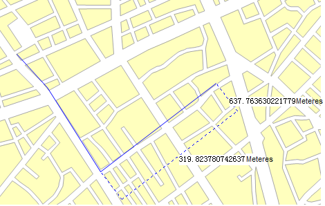
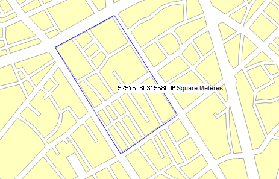
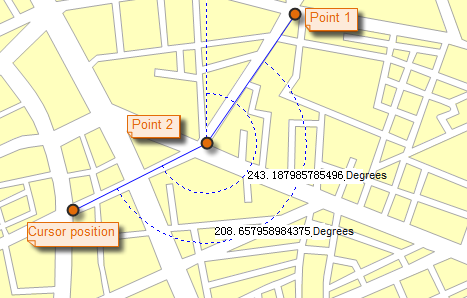

The function "Map Measure" includes Distance, Area and Angle measurements on the map. The user can turn on the Snap function for easy access to the location of interest, and undo the previous measurement by using the Ctrl + Z button. At the same time support the set of measurement units, clear the measurement results.

**Note** : The function can not work on unreasonable polygons (like self-intersection).

### Unit

It is recommended to set the unit of measure before measuring. On the Maps tab, in the Operation group, click Unit button, you can set the distance, area, angle of the unit in the pop-up dialog box. If the Automatic Conversion Unit is checked, the result will be automatically converted. For example, if the current measurement unit is in decimeter and the result is greater than or equal to 10 decimeter, the result will be converted in units of meters. If the result is greater than or equal to 1000 meters, the result will be converted in kilometers. The same inch, feet, yards, miles will automatically convert.

### Distance

Distance measurement includes both straight and geodesic distance, the straight line distance refers to the plane distance in the map. Geodetic Distance is calculated according to the Earth's surface, the measurement results more in line with the practical application, while supporting the measurement across the east and west hemisphere.

**Basic Steps:**

  1. On the Operations group click Map Measurement dropDownButton, select Distance in the drop-down menu. The mouse pointer turns to cross wire in the current window.
  2. Click to specify the start point. When you move your mouse pointer away from the start point, a temporary line shows up. 
  3. Two values are displayed at the middle and end of the line. For the first part of the polyline, the two values displayed at the middle and end of the line are the same, indicating the distance from the start point to your current mouse pointer. When you click again to start the second part of the polyline, the values displayed at the middle of this part of line and your mouse pointer are respectively the distances from the start point and second point to your mouse pointer.
  4. You can specify a set of points to get not only the distances between two connected points, but also the distance from the stat point to the end point.
  5. You can switch between the two values, the length of the current part and the total length of the entire polyline, by pressing Tab. When a value get the focus, you can copy it using Ctrl + C.
  6. Right click to finish measuring distance. The distance of each of the two connected points is displayed at the middle of the two points, and the distance from the start point to the end point is displayed at the end point of the polyline as well as in the Output Window.
  7. To clear the polyline and the distance labels, click the Clear button in the Measure group. Besides, you can press Esc to implement the clear operation.
  8. Repeat steps 1 through 7 to implement another measure distance operation.

  
Figure: Straight Line Measure distance  

### Geodesic Distance

Geodetic Distance is calculated according to the Earth's surface, the measurement results more in line with the practical application, while supporting the measurement across the east and west hemisphere.

### Area

* **Basic Steps:**

  1. On the Operations group click Map Measurement dropDownButton, select Area in the drop-down menu. The mouse pointer turns to cross wire in the current window.
  2. Click to specify the first point of the temporary polygon for measuring distance. Click again to form the first edge of the polygon. When you move the mouse pointer from the second point, the area of the temporary polygon is displayed on the map when you move the mouse pointer.
  3. Continuously click to define the polygon for polygon for measuring distance.
  4. You can press Tab to set the focus to the area value, then copy the value using Ctrl + C.
  5. Right click to finish measuring area. The area of the temporary polygon is displayed on the map as well as in the Output Window.
  6. To clear the polygon and the area label, click the Clear button in the Measure group. Besides, you can press Esc to implement the clear operation.
  7. Repeat steps 1 through 6 to implement another measure area operation.

  
Figure: Measure area  

**Note**: The feature can not work on unreasonable polygons (like self-intersection).

### Angle

**Basic Steps:**

  1. On the Map Operations tab, in the Measure group, click the Angle button. The mouse pointer turns to cross wire.
  2. Click to specify the start point of one edge, a dotted line pointing to true north shows up. Move the mouse pointer to form the edge, the included angle between the dotted line pointing to true north and the edge, also called the azimuth of the edge, is displayed.
  3. Click again to confirm the first edge, move the mouse pointer to specify the other edge. The azimuth of the second edge and the angle between the two edges are displayed on the map.
  4. Continuously click to measure included angles between edges and azimuths for all edges.
  5. You can switch between the included angle and azimuth by pressing Tab. When a value get the focus, you can copy it using Ctrl + C.
  6. Right click to finish measuring angles. Angles for each pair of connected edge are displayed around the junctions as well as in the Output Window. Also displayed in the Output window is the included angles of each edge.
  7. To clear the polyline and the angle labels, click the Clear button in the Measure group. Besides, you can press Esc to implement the clear operation.
  8. Repeat steps 1 through 7 to implement another measure angle operation.

  
Figure: Measure angel  