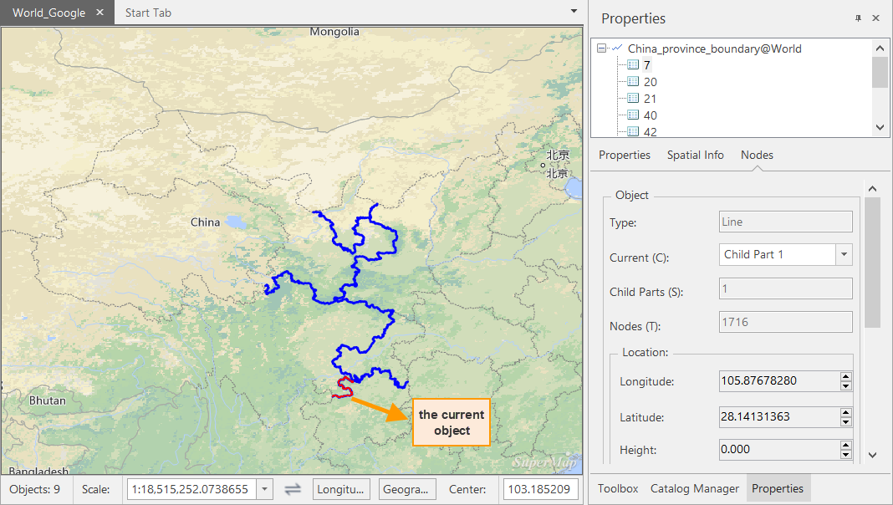

---
id: Property
title: Check and Modify Object Properties
---  
Select objects from vector datasets abd right-click to check and modify their properties. This article describes how to modify properties of geometrical objects and text objects separately.

1. Select one or more geometrical objects or text objects, right-click your mouse, and select **Properties**
2. The popup **Properties** window shows specific information on the selected object including Object Properties, Spatial Info, Nodes, and Text Info for text objects.
3. If you select multiple objects once, the panel will show all objects as a list. You can select any object to check and modify its properties. 
  

###  Properties Window Introduction

**Properties** window uses a tree structure to show all selected objects and displays all related property information.

* #### Property Information

The **Properties** panel lists field information ob the selected object including fields, type. value, and required or not.

* Hide System Fields: Hide all system fields. 
* Hide Details: Hide all other fields except the Alias and Value fields. 
* #### Spatial Info

This panel displays all spatial information on the selected object including:

* **Basic:**

**Type** : The type of the object.

**Length** : The length of the line object.

**Perimeter** : The perimeter of the region object.

**Area** : The area of the region object.

* **Bounds:**

Top, Bottom, Left, and Right: The bounds of the selected object.

* #### Nodes

This Tab displays information on nodes that compose the selected object.

* **Object** :

**Type** : the type of the selected object that can be point, line, region, and so on.

**Child Parts** : The total number of subobjects composing the object.

**Current** : lists all subobjects of the selected object. The coordinates of all vertices of the selected subobject are listed in the table to the right.

**Nodes** : The total number of the nodes of the object.

**Location** : the coordinates of the center point of the currently selected object.

* **Nodes:**

Each nodes of the selected subobject corresponds with an item in the nodes list.

If your layer is editable, you can add, modify, insert, or delete nodes.

**Add** : Add a node at the bottom of the Nodes list. The default coordinates are (0, 0).

**Insert** : Insert a vertex below the selected vertex, or black cross. The default coordinates of the newly added vertex are identical to those of the previously selected one.

**Delete** : Delete the selected vertices. The Delete button is only active If the number of vertices in the list box is greater than the number of the subobject's control vertices. A line has 2 control vertices and a region has 3.

Click **Reset** to drop the changes to the nodes.

Click **Apply** to accept the changes.

* #### Text Information

When you select text objects from your text layer, the **Properties** window will display one more panel **Text** that is for displaying and setting text styles. You can preview the text styles you set instantly.

* **Text Object:**

**Child Part** : lists all child objects of the currently selected object.

**Text** : displays and sets display content of the currently selected object.

**Rotation** : The rotation angle of the text object. Checking **Apply to Subobject** means the setting applies to the currently selected subobject only.

* **Text properties:**

**Font** : Change the font face.

**Font Size** : Change the font size.

For details about alignment, please refer to [Text Alignment](TextAlignDirection).

**Height** : Change the font height.

**Width** : Change the font width.

**BackColor** : The color of the background of the text object. Click the
color button to the right to display the color panel, in which you can
directly select a color or click More Colors at the bottom to define one.

**ForeColor** : The color of the text. Click the color button to the right to
display the color panel, in which you can directly select a color or click
More Colors at the bottom to define one.

* **Font Effects:**

Check boxes in this area to add the corresponding effects to the text object.

**Bold** : Make the text bold.

**Strikeout** : Draw a line through the middle of the text.

**Left/Right Italic** : Italicize the text.

**Underline** : Underline the text.

**Shadow** : Add shadow effects to the text.

**Outline** : Add outline effects to the text.

**Fixed Size** : Fix the size of the text objects so that they will not change with map zoom.

**Transparent** : Transparently display the back of the text.

**Alignment** : Align the text. 12 options are provided: Top Left, Top Center, Top Right, Left Baseline, Right Baseline, Bottom Left, Bottom Center, Center Left, Center, and Center Right. You can select an alignment mode from the drop-down list.

