---
id: TextAlignDirection
title: Text Alignment
---  

12 options are provided: Top Left, Top Center, Top Right, Left Baseline, Right Baseline, Bottom Left, Bottom Center, Center Left, Center, and Center Right.

Alignment uses an anchor point as the base point. The text object will move relative to the anchor point when the alignment is changed.

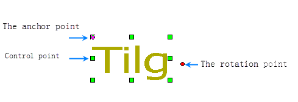 | 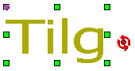 |   
---|---|---  
If the alignment of a text object is Top Left, the anchor point can be found on the top-left of the text object when it is selected, the rotation point is to the right of the text object.| Move the mouse on to the rotation point and it will change. |Select the rotation point, press the left key (the rotation point changed again) and rotate on the map, the anchor point is used as the base point for the rotation.  
  
There are three kinds of base line alignments in the 12 kinds. Base line is mainly used for English character, it is the second line in the three-line writing, for instance, abcde, all the capital letters are on the base line and the lowercase letters like gypj have a part under the base line.

The following table shows the 12 kinds of alignments and their anchor points, the auxiliary lines have no realistic meaning. The location of the auxiliary lines and anchor points are not changed, and the text object moves with the change of the alignment.

Description | Illustration | Description | Illustration | Description | Illustration  
---|---|---|---|---|---  
Top Left: the anchor point is the intersection of the top horizontal line and the left vertical line. | 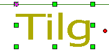 | Top Center: the anchor point is the intersection of the top horizontal line and the center vertical line. | 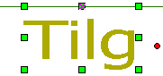 | Top Right: the anchor point is the intersection of the top horizontal line and the right vertical line. | 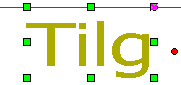  
Left Center: the anchor point is the intersection of the center horizontal line and the left vertical line. | 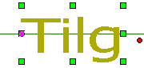 | Center: the anchor point is the intersection of the center horizontal line and the center vertical line. | 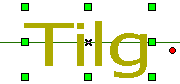 | Right Center: the anchor point is the intersection of the center horizontal line and the right vertical line. | 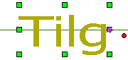    
Left baseline: the anchor point is the intersection of the baseline and the left vertical line. | 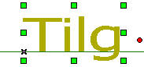 | Center baseline: the anchor point is the intersection of the baseline and the center vertical line. | 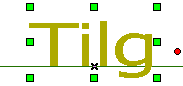 | Right baseline: the anchor point is the intersection of the baseline and the right vertical line. | 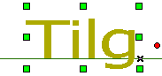    
Bottom left: the anchor point is the intersection of the bottom horizontal line and the left vertical line. | 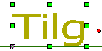 | Bottom Center: the anchor point is the intersection of the bottom horizontal line and the center vertical line. | 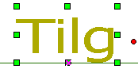 | Bottom Right: the anchor point is the intersection of the bottom horizontal line and the right vertical line. | 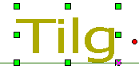  
  
It can be found in the table that except baseline alignments, the other 9 kinds of alignments' rotation base points and anchor points coincide with control points.

In the table above, the top horizontal line, center horizontal line, bottom horizontal line, left vertical line, center vertical line, right vertical line is the horizontal line or vertical line at the specific location of the text object and their location changes with the text object.

 |   
---|---  
The horizontal line and vertical line coincide with the lines in the map. | The horizontal line and vertical line of the text object rotate with the object, but the horizontal line and vertical line in the map is not changed.