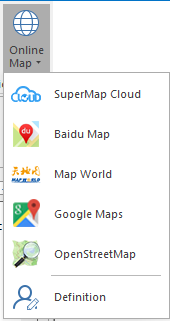

### Introduction

supports adding various map services on the map. Click Start>Datasource>Web to
add it, or click Map>Data to open the online map.

### Basic Steps

  1. New or open a map window, click Map>Data>Online Map, it will pop up a dialog. The online maps include SuperMap Cloud, Baidu Maps, Tianditu, Google Maps and OpenStreetMap.
  
    
Figure: Supported Online Maps  
  2. Select the item to load the corresponding map service.
  3. Click User-defined to pop up a dialog to load the customized service. Please see details about how to open Web Datasource in [Open Datasource](../../DataProcessing/DataManagement/OpenDatasource.htm). 