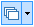

---
id: LayerControl
title: Layer Control  
---  

Layers include point, line, region, text, grid/image, and thematic map layers and layer group. All layers are displayed in the Layer Manager. You can control all layers by following two button in the "Layer Control" drop-down list.

  * **Layer nodes can be dragged** : Click  drop-down button, and then set if the layer node can be dragged by clicking "Layer nodes can be dragged" and so you can fix the order of all layers to avoid some misoperation.
  * **Layer Control** : Click  button to open the "Layer Control" dialog box. Layer Control is used to control the status of the single or multiple layers in the map window. Layer controlling is implemented through the Layer Control dialog box. The Layer Control dialog box displays the status and properties of each layer in the map window. You are allowed to change the layer status, such as visibility, selectivity, editability, snappability, scale, whether the symbols will zoom with the map, etc., change the layer order, add or remove layers, etc.

The Layer Control dialog box is composed of three parts: a toolbar, a layer list, and a setting area.

  * **Toolbar**

You are allowed to add, remove, select all, select inverse layers with tools on the toolbar. Besides, buttons re provided to change the layer order.

  * **Layer List**

The layers are listed in order. With the Up, Down, Bring to Front, and Send to Back buttons on the toolbar, you can change the layer order.

  * **Setting Area**

For different data types, settings provided in the setting area are different. If the status of the check box is , the original status will be retained.

Below is introduction to the settings for different types of layers.

[Layer Control for One Vector Layer](SingleLayerVector.htm)

[Layer Control for Multiple Vector Layers](MutiLayerVector.htm)

[Layer Control for One Image Layer](SingleLayerImage.htm)

[Layer Control for One Grid Layers](SingleLayerRaster.htm)

[Layer Control for Multiple Image/Grid Layers](MutiLayerRaster.htm)

[Layer Control for Vector and Grid Layers](MutiLayerVectorRaster.htm)

[Layer Control for One Thematic Map Layer](SingleLayerThematic.htm)

 [Select Single Layer Group](SingleLayerGroup.htm)