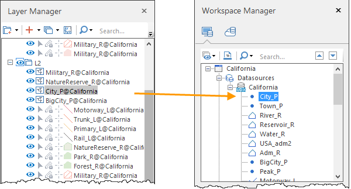

### Instructions

Locates the dataset associated with the current layer.

### Basic steps

In the context menu of your layer, select Locate Dataset. iDesktop will highlight the dataset associated with your layer.

  