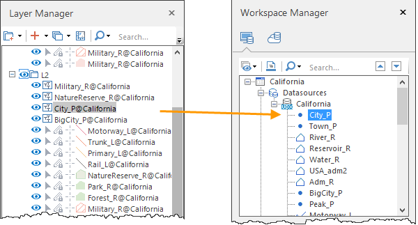

### Remove Layers from a Map

Removes a vector layer from a map.

**Function Entrances**

* Right-click your layer and select **Delete**.
* Right click your layer and press the key **Delete**.

### Rename Layer

Renames the caption of your layer.

**Function Entrances**

* Right-click your layer and select **Rename**. Type a new name directly to modify your layer's caption.
* Select your layer and press F2. And then you can type a new name. 

After modifying your layer's name, you can click your mouse at any position to apply this change.

Note

* A layer has a name and a caption. They have different functions.
* The name of a layer is automatically generated to uniquely identify a map, and it is not editable. The format is Dataset Name@Datasoruce Alias, Continent@world#1 for instance.
* By default, layer name and layer caption are identical. However, you are allowed to change the layer caption according to your needs.

### Copy and Paste Layer

During the mapping procedure, you can copy and paste a layer to the current map or other map. The result layer will retain its style and properties. Details are as follows:

* Supports copying a layer from one map and pasting it to another map.
* Supports copying a layer from one workspace and pasting it to another workspace.
* You can copy and paste common layers and thematic layers;
* You can press Ctrl C and Ctrl V operations to copy and paste a layer. Or you can select **Copy** and **Insert Data** on the context menu to copu and paste a layer.
* When pasting layer, it supports pasting the layer to the top of the layer to be pasted on Layer Manager.

### Locate Dataset

Locates the dataset associated with the current layer.

**Function Entrances**

Right click your layer and select **Locate Dataset**. iDesktop will highlight the dataset associated with your layer in the **Workspace Manager**.

### Use Snapshot Layer

A snapshot layer is a special layer group in which a layer corresponds with a
snapshot layer of the map. The snapshot layer are drawn, in a special way,
only when displayed at the 1st time. When browsed next time, if the map range
has not changed, the snapshot layer will not be redrawn, that is, the snapshot
layer will not be redrawn with map refresh. However, if the map range changes,
the refresh and redraw operation will be triggered automatically. Snapshot
layers can improve the performance of the map display.

Because the snapshot layer is a special layer group. You can add a layer group
object (LayerGroup) to the snapshot layer, but a snapshot layer can not be
added to a snapshot layer or a LayerGroup object.

Application scenario: In the process of mapping, the data amount of some layer
is large and this will affect the refresh efficiency of the map. You can
choose to add layers that must display with large data amount and low refresh
frequency to the snapshot layer. When the display range of the map does not
change, the layers in the snapshot layer group will not be refreshed,
improving the performance of the map display.

**Create Snapshot Layer**

1. In the blank area of Layer Manager, right click and select **Create Snapshot Layer** to create a snapshot layer group.
2. Select one or more layers, and move the layers to the snapshot layer group. When the display range of the map does not change, the layers in the snapshot layer group will not be refreshed

