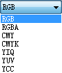

---
id: SingleLayerImage
title: Layer Control for One Image Layer
---  

In the layer list, if you have one image layer selected, the following settings are allowed in the setting area.
  
  * **Visible**

Control the visibility of the layer. Check the box to make the layers visible and uncheck to make them invisible.

  * **Layer Name**

Name of the layer, which is used to uniquely identify the layer. It cannot be modified.

  * **Caption**

Displays the layer caption. You are allowed to change the layer caption. After changing the layer caption, the caption displayed in the Layer Manager will change accordingly. However, the dataset name in the Workspace Manager will not change.

  * **Transparency**

Control the transparency of the layers. You can directly type a value indicating the transparency of the layers in the text box, or click the right arrow and move the slide bar to change the value. The transparency value is an integer ranging from 0 to 100. 0 indicates opaque and 100 indicates transparent.

  * **Max Visible Scale**

Set the maximum visible scale for the layers. Type the value in the text box to the right, 1：100000 for instance. If you zoom in beyond this scale, the layers will not be visible. The default value is 1:0, indicating the max visible scale is not set for the layers.

  * **Min Visible Scale**

Set the minimum visible scale for the layers. Type the value in the text box to the right, 1：500000 for instance. If you zoom out beyond this scale, the layers will not be visible. The default value is 1:0, indicating the min visible scale is not set for the layers.

  * **Dataset**

Click the button  on the right of the textbox, and you can reassign a new reference dataset. Select the datasource and dataset from the Datasource and Dataset dropdown list. For more information, please refer to [Changing Dataset](DTv2_BindDataNew.htm).

  * **Brightness**

Adjust the brightness of the image layers. You can directly type a value indicating the brightness of the layers in the text box, or click the right arrow and move the slide bar to change the value. The value range is from -100 to 100. If the input value is greater than 100, the brightness will be regarded as 100; if the input value is less than -100, the brightness will be regarded as -100.

  * **Contrast**

Adjust the contrast of the image layer. You can directly type a value indicating the contrast of the layers in the text box, or click the right arrow and move the slide bar to change the value. The value range is from -100 to 100. If the input value is greater than 100, the contrast will be regarded as 100; if the input value is less than -100, the contrast will be regarded as -100.

  * **Color Mode**

Set the color mode for the multi-band image data and the channels for each band to get color composite effects. Click the Color Mode dropdown arrow to display the list and select a mode from the list.

  
Figure: Color Mode  
  
For more information about color modes, please refer to [Setting the Map Color Scheme](../VisualSetting/ColorMode.htm) and [Multi-band Display Settings](../VisualSetting/DTi2_MultiBandsViewe.htm).

  * **Transparent Colors**

Transparently display cells in the image in a specified color. After checking the Transparent Colors box, the Transparent and Tolerance commands are available.

  * **Tolerance**

Set the tolerance for the transparent color. All colors within the tolerance range will be transparently displayed in the current image layer.

  * **Stretch**

Currently, 4 options are provided: None, Minimum Maximum, Standard Deviation, Gaussian.

  * **Standard Deviation Ratio**

Applicable only when the stretch mode is Standard Deviation. Standard deviation ratio determines the range of standard deviation. We suppose the range of grid cells is [a,b], if the ratio is n, the range of standard deviation during stretch is [an,bn]. The default ratio is 2.

  * **Gaussian Ratio**

Applicable only when the stretch mode is Gaussian. We suppose the range of image cells is [a,b], if the ratio is n, the central axis keeps unchanged during stretch and the image cells will display in range [0, 255]. The default ratio is 2.

### Related Topics

[Layer Control](LayerControl.htm)

[Raster Group](../VisualSetting/Rastergroup.htm)