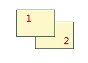

---
id: SingleLayerVector
title: Layer Control for One Vector Layer
---  

In the layer list, if you have one vector layer selected, the following settings are allowed in the setting area.
  
  * **Visible**

Control the visibility of the layer. Check the box to make the layer visible and uncheck to make it invisible.

Selectable, Editable and Snappable options will not be available any more if you uncheck Selectable.

  * **Selectable**

Control the selectability of the layer. Check the box to make the layer selectable and uncheck to make it unselectable.

  * **Editable**

Control the editability of the layer. Check the box to make the layer editable and uncheck to make it ineditable.

  * **Snappable**

Control the snappability of the layer.

  * **Layer Name**

Name of the layer, which is used to uniquely identify the layer. It cannot be modified.

  * **Caption**

Displays the layer caption. You are allowed to change the layer caption. After changing the layer caption, the caption displayed in the Layer Manager will change accordingly. However, the dataset name in the Workspace Manager will not change.

  * **Transparency**

Set the transparency of the layer. The transparency ranges from 0 to 100, with 0 indicating opaque and 100 indicating transparent.

  * **Max Visible Scale**

Set the maximum visible scale for the current layer. Type the value in the text box to the right, 1：100000 for instance. If you zoom in beyond this scale, the layer will not be visible. The default value is 1:0, indicating the max visible scale is not set for the layers.

  * **Min Visible Scale**

Set the minimum visible scale for the current layer. Type the value in the text box to the right, 1：500000 for instance. If you zoom out beyond this scale, the layer will not be visible. The default value is 1:0, indicating the min visible scale is not set for the layers.

  * **Change Dataset**

Specify a new associated dataset for the layer. Please refer to [Change Dataset](DTv2_BindDataNew.htm) for more details.

  * **Complete Line**

Control whether the line symbol of the line layer will be completely displayed. If the line length is less than a unit of the cycle length of the line symbol or is not the integer multiple of the line symbol, the lack part will not be displayed. Check to box to display the complete line symbol, optimizing the display effects.

For more details, please refer to [Complete Line](../AdvanceSetting/Linedisplay.htm).

  * **Scale Symbol**

Display/Set whether symbols, including marker symbols and line symbols, in the selected layers will zoom with the layer. This function is not applicable to all types of thematic map layers.

  * **Optimize Cross**

This function is valid when selected multiple line layers. Set whether the line layers user the crossroads optimization. It is applicable to the line layers and network layer. Please refer to [Start Crossroads Optimization](../AdvanceSetting/RoadCross.htm).

  * **Antialiasing**

This function is used to reduce zig zag effect, optimizing map display. Antialiasing taked effect when both map antialiasing and layer antialiasing are turned on. For map antialiasing, please refer to [Map Display Optimization](../../Optimization/MapOptimization/MapOptimization.htm#1). 

  * **Show Overlay**

The function is used to control whether to display overlayed objects or not. Show Overlay option in Map Properties dialog box should be checked together if you want to display overlayed objects. For detailed overlay settings, please refer to [Overlay
Settings](../../Optimization/MapOptimization/OverlaySetting.htm).

  * **Layer Style**

Change the styles of the marker symbols, line symbols, and fill symbols. Click the button to the to display the e right of the Layer Style label to display the dialog box for the symbol styles settings for the marker symbols, line symbols, or fill symbols.

For more information about style settings, please refer to [Setting Layer Styles](../LayerStyle/LayerStyleTab.htm).

  * **Order Fields** : The drawing orders will affect the display orders on the map. The objects will be displayed according to the velue orders set in the field. If the field values are the same or null, it will use the default orders of the engine. Currently, it only supports to set the object orders for a single vector layer or thematic layer. As shown below, the SmID od object 1 is 1, and the object 2 is 2. According to the SmID fields, ascend and descend the fields, and the result is:

Field | Sort | Icon  
---|---|---  
SmID | Ascending |   
SmID | Descending |   
  
  * **Transparency**

Control the transparency of the layer. You can directly type a value indicating the transparency of the layers in the text box, or click the right arrow and move the slide bar to change the value. The transparency value is an integer ranging from 0 to 100. 0 indicates opaque and 100 indicates transparent.

  * **Min Object Size**

Set the minimum display size of objects in the current layer. You can directly input a value in the text box. The unit is mm. While zooming in or out the map, the geometric object would be hidden if the width or height of the bounding box of the object is less than the value you set here. This function is not applicable to point layer.

  * **Filter Expression**

Filters objects in the current layer. Click the  button and construct the filter expression in the SQL Expression dialog box. After composing the SQL expression, click OK to filter out objects not satisfying the expression. For more information about SQL expressions, please refer to [SQL Query Dialog Box](../../Query/SQLDia.htm).

  * **Dataset**

Change the dataset referenced by the current layer. Click the button  on the right of the textbox, and you can reassign a new reference dataset. Select the datasource and dataset from the Datasource and Dataset dropdown list. For more information, please refer to [Changing Dataset](DTv2_BindDataNew.htm).

### Note

  1. CAD layers don't support for changing layer styles. Other functions are similar to point, line, and region layers.
  2. While adding network dataset to the map window, a node layer and a network layer will be generated. The layer control settings for the node layer of a network dataset is similar to the point layer and the network layer is similar to the line layer.

### Related Topics

[Layer Control](LayerControl.htm)