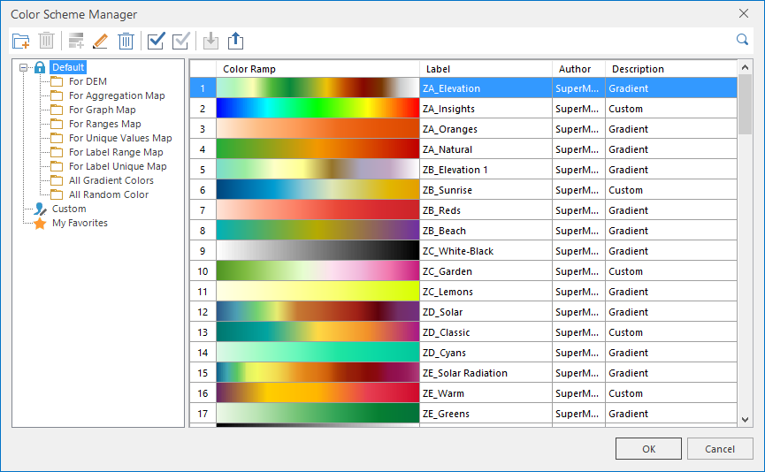

Manages the color schemes used in the program. SuperMap provides a set of commonly used color schemes in the Color Scheme Manager. Certain color schemes are prepared for particular use, like the elevation color scheme. Besides, you are allowed to create your own color schemes to satisfy your needs.

More than 190 default color schemes are provided by default. Each default color scheme is stored individually in a separate folder. The default storage location is Installation directory\Templates\ColorScheme\\.

**Enable Color Scheme Manager**

Click **Start** tab > **Color Management** group > **Color Management** > **Color Scheme** to open the **Color Scheme Manager** dialog box where you can add, edit, delete, import, export, custom color schemes, and add to favorites.

The following picture shows the **Color Scheme Manager** dialog box.

  
 
  
The **Color Scheme Manager** divides all color schemes into 9 groups including For DEM, For Aggregation Map, For Graph Map, For Ranges Map, For Unique Values Map, For Label Range Map, For Label Unique Map, All Gradient Colors, and All Random Color.

### Delete Color Scheme

Deletes the unnecessary color schemes from the color scheme manager.

In the **Color Scheme Manager** dialog box select one or more color schemes and click the **Delete** icon button.

### Related Topics

[Manage Color Schemes](ManageColorRamp)

