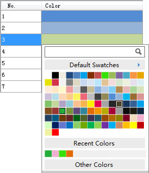

---
id: EditColorRamp
title: Editing Color Schemes 
---  

### Introduction

Change and adjust existing color schemes.

### Basic Steps

  1. In the Color Scheme Manager, select a color scheme and click the Edit button  to display the Color Scheme Editor. Or, you can double click a color scheme to display the Color Scheme Editor.

  2. If you need to open other color scheme, in the Color Scheme manager, click the  button. Select the color scheme you need.
  3. To add colors to the color scheme, use the Add Color button .

  
Figure: Color Editing Panel 

  4. To delete colors for the color scheme, use the Delete button .
  5. To reverse the sequence of the colors, use the Reverse button .
  6. Change the basic information of the color scheme.
  7. Modify the Change Style and Intervals.
  8. Save the modified color scheme file. To save the modified color scheme as another file, you need to specify another location.
  9. Click OK to finish.

### Related Topics

[Color Scheme Manager](ColorRampManager.htm)