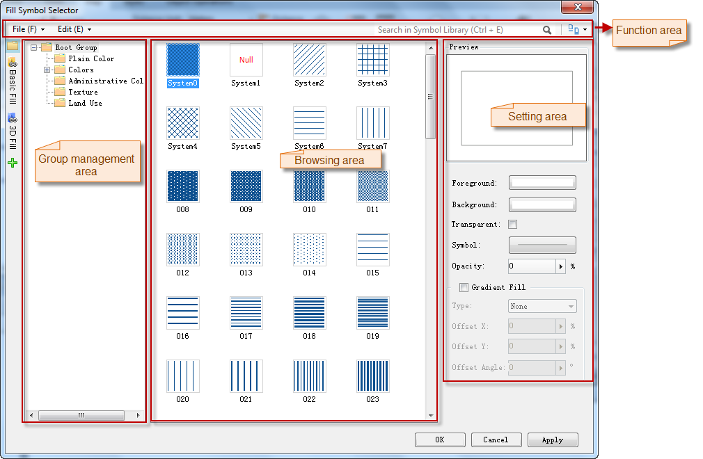
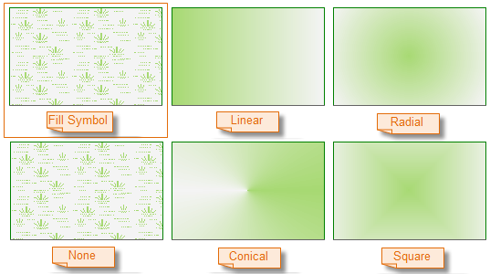

---
id: FillSymStyle
title: Fill Symbol Style Settings 
---  

Below is the Symbol Library window (Style Settings Window) with the fill symbol library loaded.

  1. **Select the Fill Symbol:**

Find the fill symbol and highlight it.

  2. **Set the Display Style:**

You can preview the style of the marker symbol in the Preview area.

You can set the style for a selected fill symbol before applying it to region objects.

  
Figure: The Symbol Library window (Style Settings window)  

  * ForeColor: The foreground color of the fill symbol. To set the ForeColor for a fill symbol, click the color button to display the color panel, then you can either click Pick to pick a color from your screen, directly select a color from the color panel, or click More Colors... for custom settings.
  * BackColor: The background color of the fill symbol. To set the BackColor for a fill symbol, click the color button to display the color panel, then you can either click Pick to pick a color from your screen, directly select a color from the color panel, or click More Colors... for custom settings.
  * Transparent: Transparently display the background of the fill symbol.
  * Transparency: The transparency of the fill symbol. You can specify the transparency of the fill symbol by typing in the integerUpDown, or by moving the slide bar that appears when clicking the right arrow. The transparency is between 0 and 100, with 0 being fully opaque and 100 being fully transparent.
  * Gradient Fill: Fill with the color gradient instead of the fill symbol specified at Step 1. The two-color gradient from ForeColor to BackColor will be employed.
  * Parameters for Gradient Fill:

Gradient Mode: The mode of the gradient fill. 5 modes are provided.

(1) None: Fill with the fill symbol specified at Step 1 instead of the color
gradient.

(2) Linear: The linear gradient is the most basic of all gradients, a simple
linear transition between two colors.

(3) Radial: Radial gradient that starts from the gradient center.

(4) Conical: Conical gradient that looks like a cone.

(5) Square: The square gradient produces a square blend, imitating the visual
perspective in a corridor or the aerial view of a pyramid.

  
Figure: Gradient Modes (the ForeColor and BackColor are green and white)  
  
Gradient Angle: The rotation angle of the fill.

Offset X: The percentage of the gradient center to the fill center in the
horizontal direction. You can specify the value by typing in the
integerUpDown, or by moving the slide bar that appears when clicking the right
arrow.

Offset Y: The percentage of the gradient center to the fill center in the
vertical direction. You can specify the value by typing in the integerUpDown,
or by moving the slide bar that appears when clicking the right arrow.

  * Line Style: The line style of the borders. To get more information on how to set line styles, please refer to [Line Symbol Style Settings](LineSymStyle.htm).
3. When finished, click OK to apply the settings and close the Style Settings window.

### Notes

When the vector cache layer sets the layer style, it only supports to set the
3D symbols.