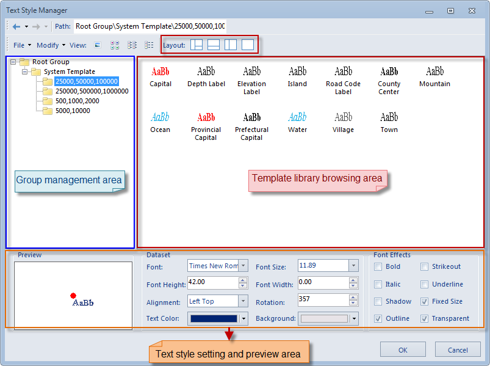
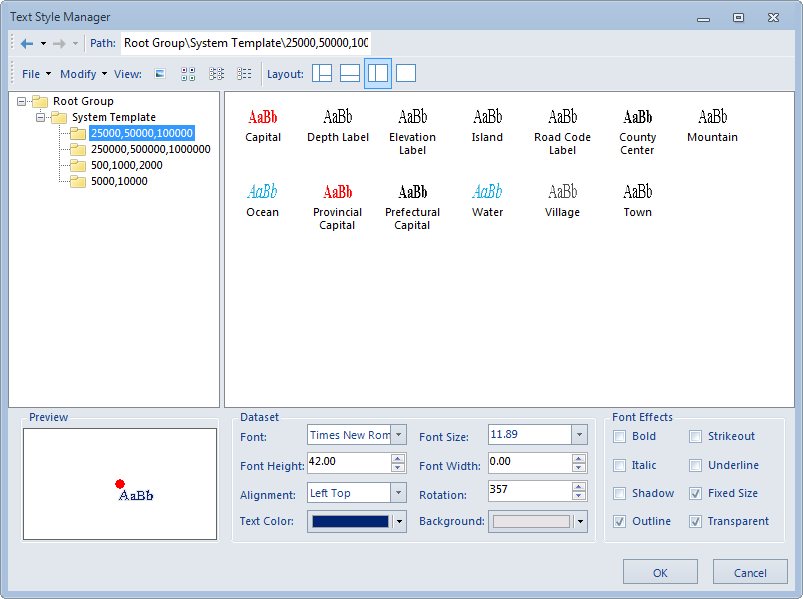
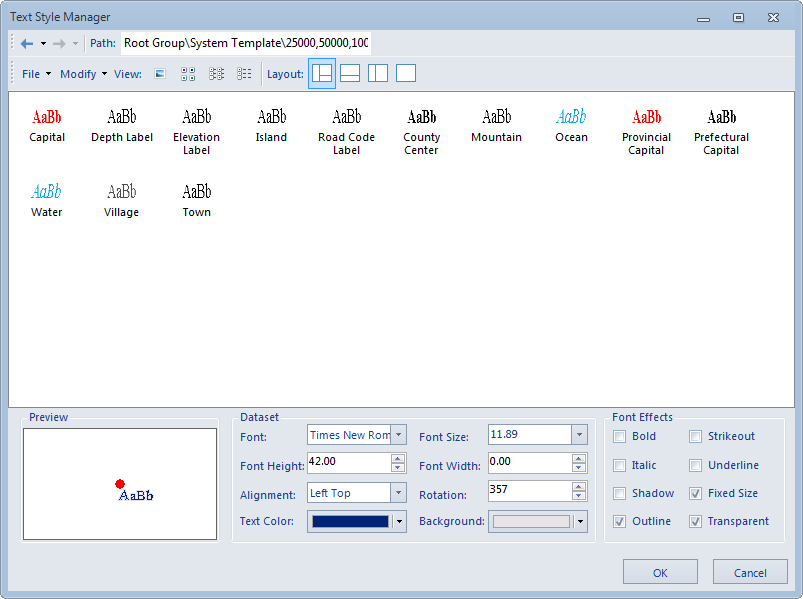
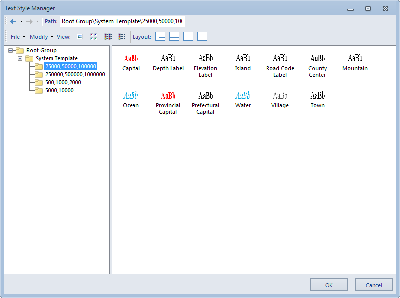
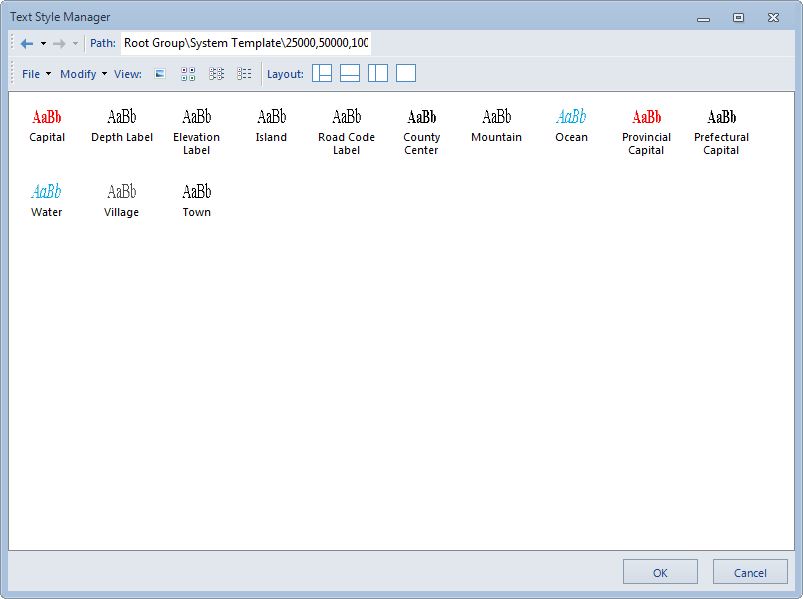

---
id: LayoutButton
title: Layout
---  

The Layout command allows you to control the layout of the template library window. You can change the template library window layout by clicking the corresponding buttons to the right.

  
  
  * Show All: The template library explorer, template pane, style setting area are all displayed. 

    

  * Hide Left: The template pane and style setting area are displayed, while the template library explorer is hidden. 

    

  * Hide Bottom: The template library explorer and template pane are displayed, while the preview and style setting area is hidden.
    
 
  * template Pane Only: The template pane is displayed, while the template library explorer and the style setting area are hidden. 
    