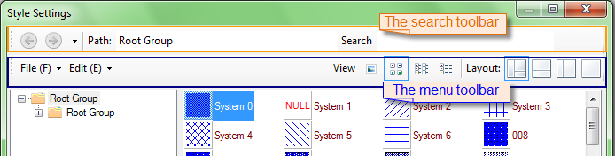
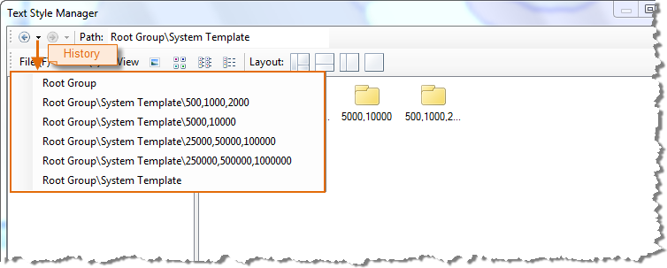
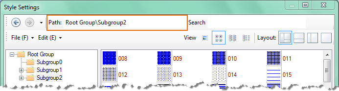
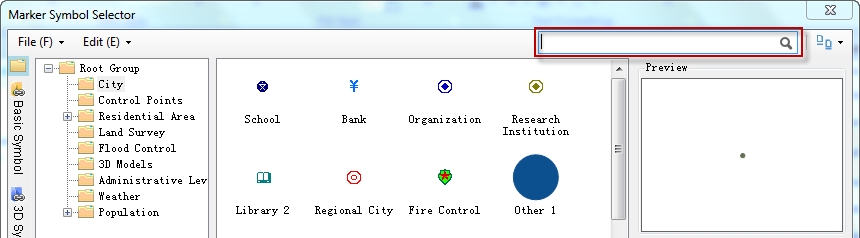
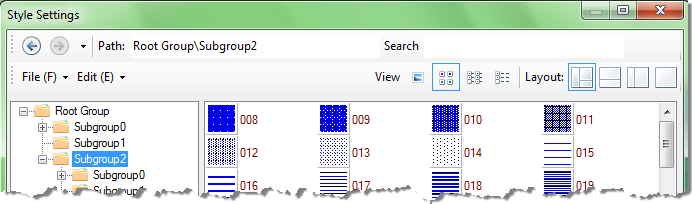

---
id: ManagerUIFunctions
title: Function Area  
---  

The function area contains the search toolbar and menu toolbar.

  
  
  * **The Search Toolbar**

The search toolbar provides the following 3 functions.

    1. History: The paths of the recently browsed symbols are provided in the drop-down list. You can navigate to a recently browsed subgroup by clicking the corresponding record in the drop-down list. Besides, you can click the Backward and Forward buttons to go backward and forward.

  

    2. Path: The path of the symbol being browsed, that is, the subgroup where the symbol is located. You can type a path in the text box to navigate to the corresponding subgroup. All symbols in the subgroup will be displayed, while the subgroups in it will not be displayed.

  

    3. Search: Type in the text box to search for symbols.
  

  * **The Menu Toolbar**

The menu toolbar contains the File and Edit menus, the view and Layout buttons.

  

  
  [File Menu](SymManagerFile.htm)

  [Edit Menu](SymManagerEdit.htm)

  [Layout](SymManagerLayout.htm)

  [View](SymManagerDisplay.htm)