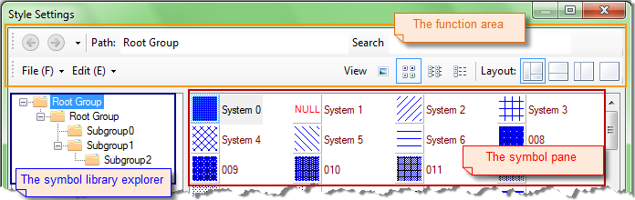

---
id: ManagerUIGroupBrowse
title: Symbol Library Explorer and Symbol Panel
---  

The symbol library explorer and symbol pane are allows you to efficiently manage the subgroups and symbols in the symbol library. The function and appearance of the symbol library explorer are similar to those of the Windows explorer.

### The Symbol Library Explorer

The symbols are logically organized in different groups in the symbol library. For each symbol library, there is only one root group. Symbols can be placed in the root group or its subgroups. Each subgroup can contain one or more symbols or subgroups.

The symbol library explorer allows you to visually manage the subgroups of the symbol library. The root group and subgroups of the symbol library are displayed in a tree hierarchy based on its original structure in the symbol library explorer. The root node of the tree corresponds to the root group of the symbol library, and each child node of the tree corresponds to a subgroup of the symbol library.

You can click a node in the tree to display the its symbols and subgroups in symbol pane. Subgroups are displayed as folders in the symbol pane.

  
Figure: The symbol library explorer  
  
### The Symbol Pane

The symbol pane is used to display the subgroups and symbols in a group. You can highlight a node in the symbol library explorer to view its subgroups and symbols. Also, you can type a path in the Path text box to navigate to the corresponding subgroup.

In the symbol pane, you can view the subgroups and symbols of a group in Large Icons, Small Icons, List and Details.