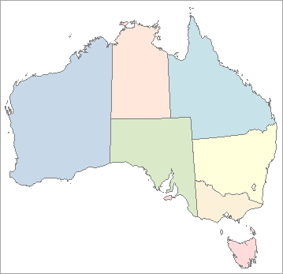

### Introduction

The **Soften** function helps soften the fill color of the region layer, that is reducing the fill color saturation, adjusting the hue and brightness values, and optimizing the fill color of regions layers in the map.

### Basic Steps

1. Open the map that needs background soften.
2. On the Style Settings tab, in the Fill Style group, click the Soften button to soften the fill color of the region layers in the map, reduce the the fill color saturation and optimize the map display effects.

###  Note

1. Soften Fill function only applies to fill colors of region layers, unique values maps, ranges maps in the map. The color of other layers will not change.
2. This function does not support rollback, it is suggested you backup layer color ahead.

