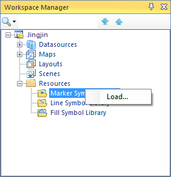
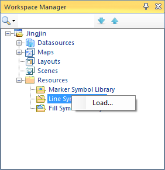
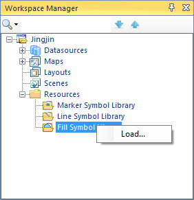
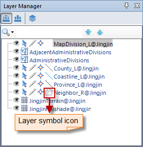

---
id: OpenSymManager
title: Opening the Symbol Libraries 
---  

The Symbol Library Window appears in two forms: the Symbol Selector window and Style Settings window. The former one is mainly used to browse, manage symbol library files. Except for those functions, the Style Setting window can also be used for setting the symbol styles. The operations in the two windows are the same.

You can open the Symbol Library window through:

  1. **The Workspace Manager**

In the Workspace Manager, click the plug sign before the Resources node to display the child nodes for the Marker Symbol Library, Line Symbol Library, and Fill Symbol Library. Then you can:

  * Right click on the Marker Symbol Selector node and click Load Marker Symbol Selector... to open the Marker Symbol Library window and load the marker symbol library.
  * Right click on the Line Symbol Selector node and click Load Line Symbol Selector... to open the Symbol Library window and load the line symbol library.
  * Right click on the Fill Symbol Selector node and click Load Fill Symbol Selector... to open the Symbol Library window and load the fill symbol library.

| |   
---|---|---  

  2. **The Layer Manager**

In the Layer Manager, you can double click the symbol icon for a layer to open the Styles window.

  * Double click the symbol icon for a point layer to display the Styles window with the marker symbol library loaded.
  * Double click the symbol icon for a line layer to display the Styles window with the line symbol library loaded.
  * Double click the symbol icon for a fill layer to display the Styles window with the fill symbol library loaded.

  
---  
  3. **The Styles Tab**

The Styles tabs associated with the map or layout windows allows you to open the Styles window through commands on the Ribbon.

  * To open the Styles window for points, click the Style Settings tab, click the Marker Symbol in the Marker Style group, and then click More Symbols... at the bottom. The Styles window appeared loads the predefined library served by system. 
  * To open the Styles window for lines, click the Style Settings tab > Line Symbol in the Line Style group, and then click More Symbols... at the bottom. The Styles window appeared loads the predefined library served by system. 
  * To open the Styles window for filled symbols, click the Style Settings tab, click the Fills in the Fill Style group, and then click More Symbols... at the bottom. The Styles window appeared loads the predefined library served by system. 
  4. **Other Ways**

You have some other ways to open the Symbol Library window (Style Settings window). For instance, you can open the Style Settings window when setting item styles for the thematic maps.