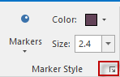

---
id: PointStylegroup
title: Setting Point Layer Styles
---  

The Marker group on the Styles tab organizes functions for setting marker styles for point objects. Only when you have selected point objects in the current editable point layer, the Marker group under the Styles tab will be available for use.

  
Figure: Marker Group  
  
* **Markers**

The Markers button in the Marker Style group is used to specify how to draw the selected point objects.

  * When you click the Markers drop-down arrow, the marker symbol panel as shown below will be displayed. The marker symbols most recently used are listed on top. 
  * You can select a marker symbol in the panel to apply it to the selected objects in the current layout window or click More Symbols to display the Marker Symbol Selector dialog box, in which you can set the properties before applying a marker symbol to the selected point objects.
  * Points in the layer will be instantly rendered with selected marker style.
  
* **Marker Color**

With the Color button, you can specify the display color of the marker symbol in the current layout window.

  * Click the arrow next to the Color button to display the color panel and click a color to apply it to the selected markers. After clicking OK, the color will be applied to markers in the current layer.
  * Beside that, you can click More Colors in the color panel to display the Color dialog box for custom settings.
  * Some symbols are so special that they have fixed colors in certain fields. In SuperMap Deskpro .NET, most of these symbols are provided in raster formats and you are not permitted to modify their colors.
  
* **Marker Size**

Specify the display size of marker symbol.

  * You can directly select a value from the dropdown list or directly type a value in the box, and then press Enter to apply the size.
  * The accuracy of the value is 0.1 mm.
  
* **Group Dialog Box**

You can change the marker style in the group dialog box for marker symbols to get favorable effects.

  * About settings in the group dialog box, please refer to [Setting Marker Styles](PointSymStyle.htm).

###  Layer Style panel

Double click your point layer in the Layer Manager to open the Layer Style where you can set point styles like point symbol, size, color, rotation and so on. The panel is the same with the "Marker Symbol Library" in organization. For detail settings of style, please consult [Line Symbol Style Settings](PointSymStyle.htm).

**Note** : The settings are worked for all lines in your lines layer.
  
### Related Topics

[Saving Style Template to Library](DTv2_SaveStyleTempl.htm)