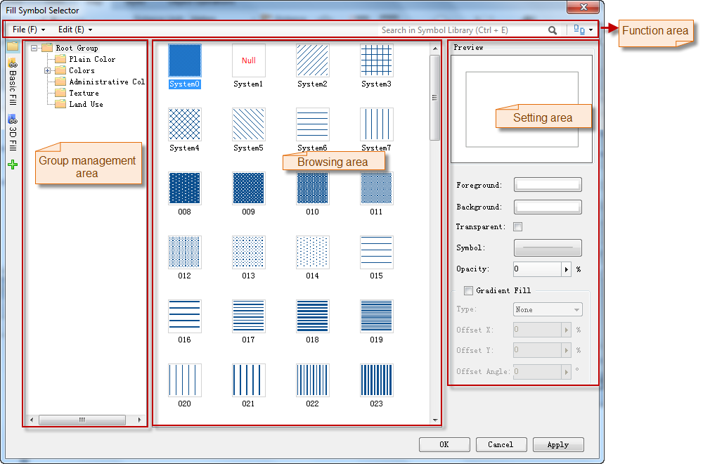

Below is the Fill Symbol Selector window with the fill symbol library loaded. The Symbol Library window is composed of the function area, symbol pane, symbol library explorer, and the style setting area.

Note: In the workspace click **Resources** > **Fill Symbol Library** to open the **Fill Symbol Selector** for browsing and managing symbol libraries.

  
 
  
**Functional Area**

**The child group management area and symbol browse area.**

**Symbol setting area**
