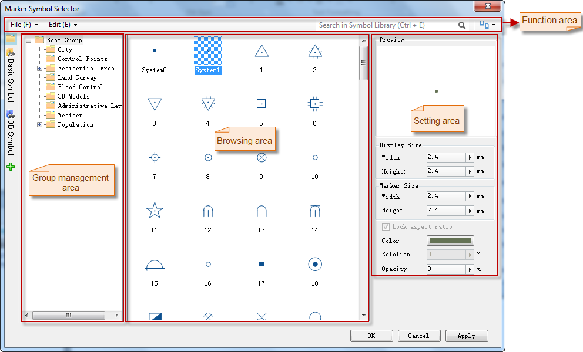

Below is the Symbol Library window (Style Settings Window) with the marker symbol library loaded.

* **Select the Marker Symbol:** Find the marker symbol and highlight it.
* **Set Styles for Marker Symbol**: Vector, raster, and model marker symbols are supported.

You can preview the style of the marker symbol in the Preview area.

Parameters for different types of marker symbols are different.

**Vector point symbol**

* **Marker Size** : The size of the marker symbol. 
* **Transparency** : The transparency of the marker symbol. You can specify the transparency of the marker symbol by typing in the integerUpDown, or by moving the slide bar that appears when clicking the right arrow. The transparency is between 0 and 100, with 0 being fully opaque and 100 being fully transparent.
* **Color** : The color of the marker symbol. To set the color for a marker symbol, click the color button to display the color panel, then you can either click Pick to pick a color from your screen, directly select a color from the color panel, or click More Colors... for custom settings.

**Grid type point symbol**

* Transparency: The transparency of the marker symbol. You can specify the transparency of the marker symbol by typing a value, or by moving the slide bar that appears when clicking the right arrow. The transparency is between 0 and 100, with 0 being fully opaque and 100 being fully transparent.

**3D model symbol**

* Marker Size: The size of the marker symbol. 
  * Scale X: The scale of the symbol on the X axis. You can directly input a value or move the slide bar that appears when clicking the right arrow. In the Preview area, the snapshot of the model symbol changes in the width.
  * Scale Y: The scale of the symbol on the Y axis. You can directly input a value or move the slide bar that appears when clicking the right arrow. In the Preview area, the snapshot of the model symbol changes in the height.
  * Scale Z: The scale of the symbol on the Z axis. You can directly input a value or move the slide bar that appears when clicking the right arrow. Since the Preview area displays the snapshot of the model symbol, the scale Z can not be represented.
  * Lock Aspect Ratio: Maintains the shape and proportions of the marker symbol while changing the Scale X, Y, or Z. By default, the box is not checked. If checked, the other two will change accordingly to keep the aspect ratio if any of the three changes.
* Transparency: This parameter is invalid for model symbols.

* When finished, click OK to apply the settings and applied the changes.

### Notes

When the vector cache layer sets the layer style, it only supports to set the 3D symbols.

