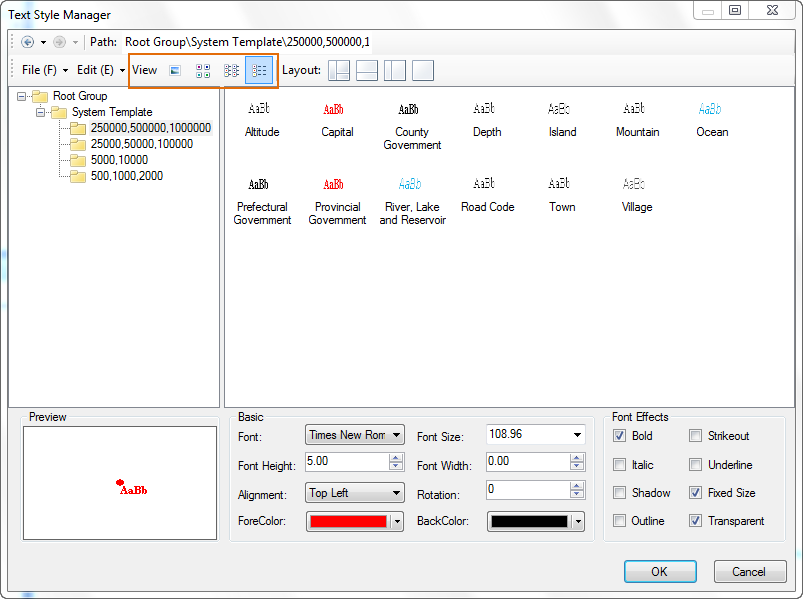
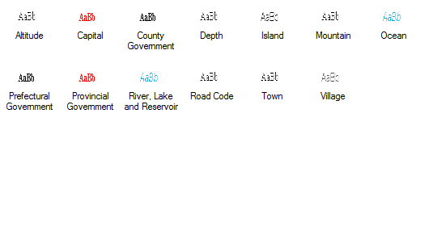
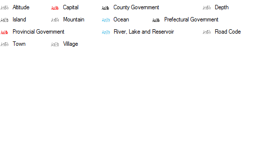
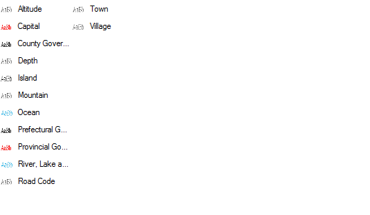
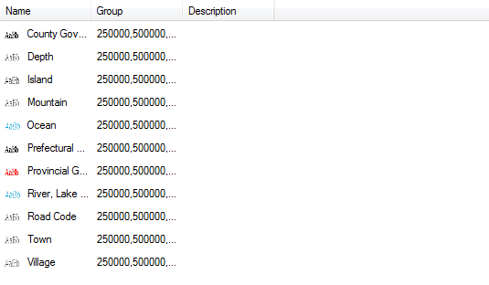

---
id: SymManagerDisplay
title: View
---  

The View command allows you to change the way the items in the symbol pane are displayed.

  

  
You can choose to display the subgroups and symbols in the symbol pane in Large Icons, Small Icons, List or Details by clicking corresponding buttons to the right.

 |   
---|---  
Large Icons | Small Icons  
 |   
List | Details  