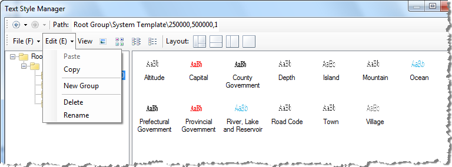

---
id: SymManagerEdit
title: Edit Menu 
---  

Below is the Edit menu in the function area of the symbol library window.

  
---  
  
  1. **Copy**

Copy a selected group, the root group excluded, to the clipboard. Basic Steps:

  * In the symbol library explorer, highlight a subgroup.
  * Click Copy in the Edit menu to copy all symbols and subgroups in it to the clipboard.
  2. **Paste**

Paste the subgroup in the clipboard into the specified group. Basic Steps:

  * In the symbol library explorer, highlight a group, the root group included, where you want to paste the subgroup in the clipboard.
  * Click Paste in the Edit menu to paste the subgroup in the clipboard into the selected group.
  3. **New Group**

Create a subgroup in a group. the root group included. Basic Steps:

  * In the symbol library explorer, highlight a group.
  * Click New Group in the Edit menu to create a new subgroup in the selected group.
  4. **Delete**

Delete a selected group, the root group excluded. Basic Steps:

  * In the symbol library explorer, highlight a subgroup.
  * Click Delete in the Edit menu to delete all symbols and subgroups in it.
  5. **Rename**

Rename a selected group, the root group included. Basic Steps:

  * In the symbol library explorer, highlight a group.
  * Click Rename in the Edit menu.
  * The name of the subgroup is turned into editable. Type a new name and press Enter.