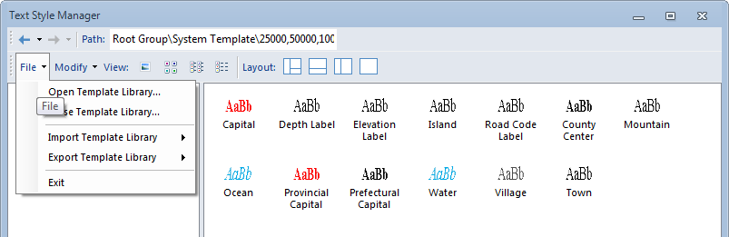

---
id: SymManagerFile
title: File Menu 
---  

Below is the File menu in the function area of the symbol library window.

  

  
  1. **Open Symbol Library...**

Close the current symbol library and open another one in the symbol library window. The symbol library can be in *.sym (marker symbol library), *lsl (line symbol library), or *.bru (fill symbol library) format.

Click Open Symbol Library... to display the Open dialog box, navigate to the folder where the symbol library you want to open is located, highlight the symbol library, and click open.

  2. **Close Symbol Library...**

Close the current symbol library in the symbol library window.

  3. **Import Symbol Library...**

Import another symbol library into the symbol library window.

Click Import Symbol Library... to display the Open dialog box, navigate to the folder where the symbol library you want to open is located, highlight the symbol library, and click open.

  4. **Export Symbol Library...**

Export the current symbol library in the symbol library window into other symbol file. 

Click Export Symbol Library... to display the Save As dialog box, navigate to the folder where you want to place the new symbol file, name it, and click Save.

  5. **Exit**

Close the symbol library window.