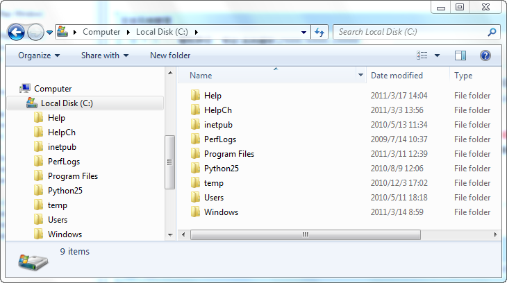

---
id: TextStyleFolderMange
title: Template Library Explorer 
---  

The template library explorer is used to manage the subgroups in the template library.

### Template Library Explorer

The templates are logically organized in different groups in the template library. For each template library, there is only one root group. templates can be placed in the root group or its subgroups. Each subgroup can contain one or more templates or subgroups.

The template library explorer allows you to visually manage the subgroups of the template library. The root group and subgroups of the template library are displayed in a tree hierarchy based on its original structure in the template library explorer. The root node of the tree corresponds to the root group of the template library, and each child node of the tree corresponds to a subgroup of the template library.

You can click a node in the tree to display the its templates and subgroups in template pane. Subgroups are displayed as folders in the template pane.

  
Figure: The template library explorer  

  
Figure: The Windows explorer  
  
### Template Library Explorer Context Menus

The context menus for the template library explorer include:

The right-click menu of root in template library group management area

The image below shows the context menu for the root group in the template library explorer.

  
  
  1. **New Group**

Create a subgroup in the root group.

  2. **Rename**

Change the name of the root group.

  3. **Paste**

Paste the subgroup in the clipboard into the root group.

  4. **Export**

To export all contents in the root group into a template library file, click Export, specify the destination and file name in the dialog box that appears, then click Save.

  5. **Import**

Import another template library. Click Import to display the Open dialog box, navigate to the folder where the template library you want to open is located, highlight the template library, and click open.

The template library file can be in either *.sym (marker template library), *.lsl (line template library), or *bru (fill template library) format.

The right-click menu of subgroups in template library subgroup management area

  

  
  1. **New Group** : Create a subgroup in the selected subgroup. Basic Steps: 
  * In the template library explorer, right click on a subgroup. 
  * Click New Group in the context menu that appears.
  2. **Copy** : Copy a selected subgroup to the clipboard. Basic Steps: 
  * In the template library explorer, right click on a subgroup to display the context menu.
  * Click Copy to copy all templates and subgroups in it to the clipboard.
  3. **Paste** : Paste the subgroup in the clipboard into the specified subgroup. Basic Steps: 
  * In the template library explorer, right click on a subgroup where you want to paste the subgroup in the clipboard.
  * Click Paste in the context menu that appears.
  4. **Delete** : Delete the selected subgroup, including all templates and subgroups contained in it. Basic Steps: 
  * In the template library explorer, right click on a subgroup.
  * Click Delete in the context menu that appears.
  * A prompt dialog box pops up to confirm if you want to delete the selected subgroup. Click OK to delete and Cancel to go back.
  5. **Rename** : Rename the selected subgroup. Basic Steps: 
  * In the template library explorer, right click on a subgroup.
  * Click Rename in the context menu that appears.
  * The name of the subgroup is turned into editable. Type a new name and press Enter.
  6. **Export** : Export all templates and subgroups in the selected subgroup into a template library file. Basic Steps: 
  * In the template library explorer, right click on a subgroup.
  * Click Export in the context menu that appears.
  * In the Save As dialog box that appears, specify the destination and file name for new template library file, then click Save.