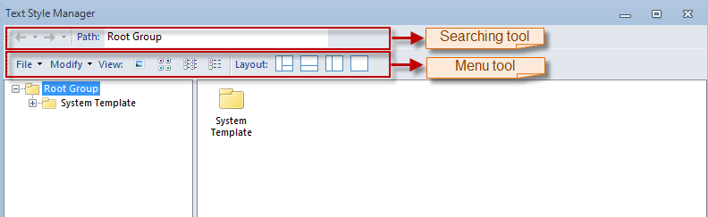
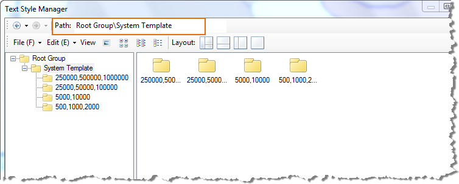
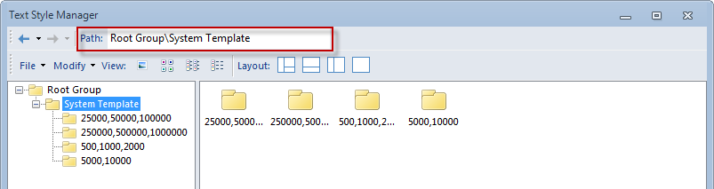

---
id: TextStyleManageFunction
title: Function Area
---  

The function area contains the search toolbar and menu toolbar.

  

* **The Search Toolbar**
* The search toolbar provides the following 3 functions.

1. **History** : The paths of the recently browsed templates are provided in the drop-down list. You can navigate to a recently browsed subgroup by clicking the corresponding record in the drop-down list. Besides, you can click the Backward and Forward buttons to go backward and forward.  

  

2. **Path** : The path of the template being browsed, that is, the subgroup where the template is located. You can type a path in the text box to navigate to the corresponding subgroup.  

  

* **The Menu Toolbar**
* The menu toolbar contains the File and Edit menus, the View and Layout buttons.

  

  
  [File Menu](FileMenu.htm)

  [Edit Menu](EditMenu.htm)

  [View](DisplayButton.htm)

  [Layout](LayoutButton.htm)