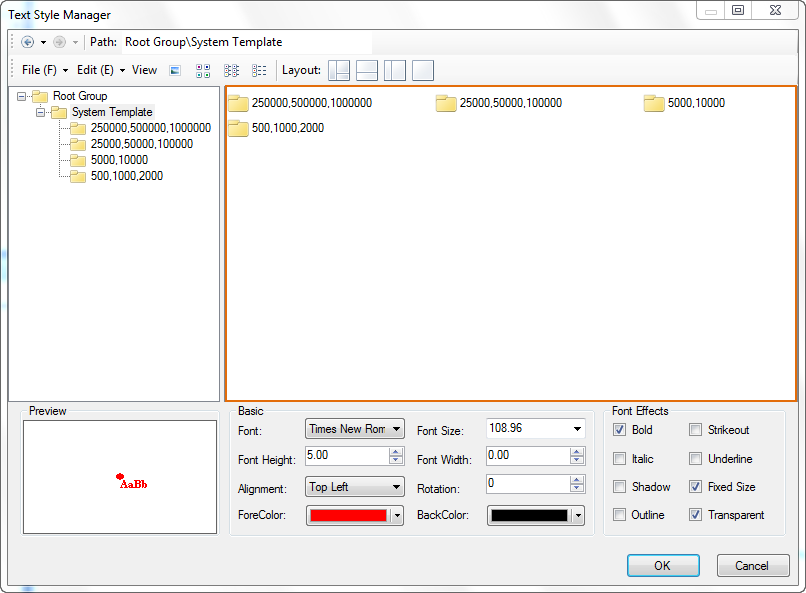
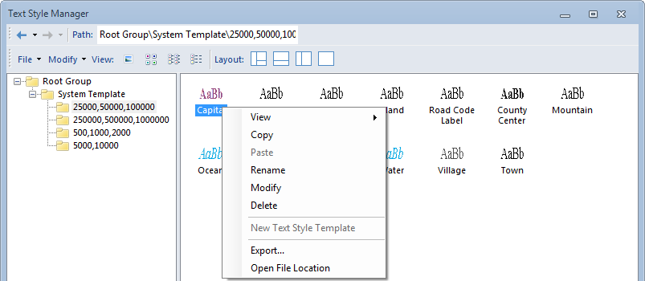
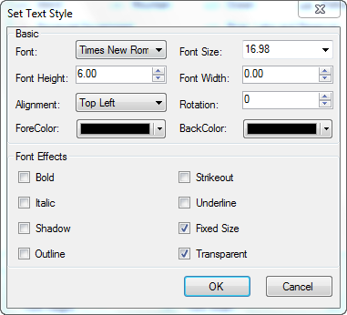

---
id: TextStyleMangeBrowse
title: Template Pane
---  

### Template Pane

The template pane is used to display the subgroups and templates in a group. You can highlight a node in the template library explorer to view its subgroups and templates. Also, you can type a path in the Path text box to navigate to the corresponding subgroup.

  
  
In the template pane, you can view the subgroups and templates of a group in Large Icons, Small Icons, List and Details.

### Template Pane Context Menus

The right-click menu of templates selected in the template area

The image below shows the context menu for the selected template or subgroup in the template pane.

  

  1. **View** : You can select to view the templates and subgroups in a group in Large Icons, Small Icons, List or Details. Basic Steps: 

  * Right click in the empty region in the template pane. 
  * In the context menu that appears, point to View, click the view style in which you want to display all items.
  * The View command will also be displayed in the context menu if you select one or more items on the template pane and right click. 
  2. **Copy** : Copy the selected items to the clipboard. Basic Steps: 
  * Select one or more templates or subgroups on the template pane. The way of selecting several templates and subgroups on the template pane at a time is similar to that of simultaneously selecting several files and folder in Windows Explorer.
  * Right click to display the context menu, click Copy to copy the selected items to the clipboard.
  3. **Paste** : Paste the templates and subgroups in the clipboard into the specified subgroup. Basic Steps: 
  * In the template library explorer, navigate to the target group where you want paste the contents in the clipboard.
  * Right click on the empty area and click paste in the context menu that appears.
  4. **Rename** : Rename the selected subgroup. Basic Steps: 
  * In the template library explorer, right click on a subgroup.
  * Click Rename in the context menu that appears.
  * The name of the subgroup is turned into editable. Type over in the text box and press Enter.
  5. **Delete** : Delete the selected templates and subgroups. Basic Steps: 
  * Select one or more templates or subgroups on the template pane. The way of selecting several templates and subgroups on the template pane at a time is similar to that of simultaneously selecting several files and folder in Windows Explorer.
  * Right click on the selected items and click Delete in the context menu that appears.
  * A prompt dialog box pops up to confirm if you want to delete the selected items. Click OK to delete and Cancel to go back.
  6. **Export** : Export the selected templates and subgroups into a template library file. Basic Steps: 
  * Select one or more templates or subgroups on the template pane. The way of selecting several templates and subgroups on the template pane at a time is similar to that of simultaneously selecting several files and folder in Windows Explorer.
  * Right click on the selected templates and subgroups and click Delete in the context menu that appears.
  * In the Save As dialog box that appears, specify the destination and file name for new template library file, then click Save.

The right-click menu of templates unselected in the template area

The image below shows the context menu for the selected template or subgroup in the template pane.

  

1. **View** : You can select to view the templates and subgroups in a group in Large Icons, Small Icons, List or Details. Basic Steps: 
  * Right click in the empty region in the template pane.
  * In the context menu that appears, point to View, click the view style in which you want to display all items.
2. New Text Style Template: Create a new text style template in the current path. Basic Steps: 
  * Right click in the empty region in the template pane.
  * In the context menu that appears, click New Text Style Template to display the dialog box for style template settings. 

  

  * When finished, click OK to exit. A new template is added to the current path. 