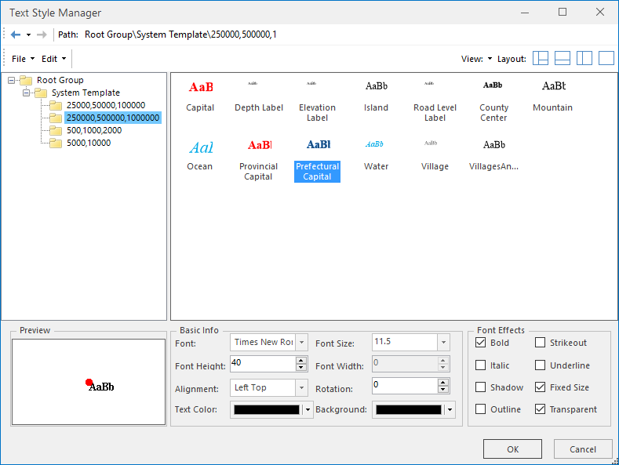

You can manage all templates no matter provided by system or customized by system in the "Text Style Manager" dialog box which appears by clicking "Styles" tab > "Text Style" gallery > Templates Manager.

  
Figure: The Text Style Manager  

* **Function Area** : Contains the search toolbar and menu toolbar. The search toolbar allows you to go to the previous and next paths, and view the history. The menu toolbar contains the File and Edit menus, the View and Layout buttons. For more detailed information, please refer to [Function Area](TextStyleManageFunction.htm).
* **Template Library Explorer** : By clicking the corresponding folder in the Root Folder, you can see the system and custom templates. You are allowed to create, rename, delete, copy templates or template folders. Also, you can export templates to a specified location. Please refer to [**Template Library Explorer**](TextStyleFolderMange.htm).
* **Template Pane:** Used to display the subgroups and templates in a group. You can create or modify a text style template in the template pane. For more detailed information, please refer to [Template Pane](TextStyleMangeBrowse.htm). 

Note, "Ocean", "Water" in the two templates, the font used are left italic, but SuperMap support "italic" font effect can only be set to right italic.If you want to achieve the left Italic effect, you can use a third-party font library [Left Italic](img/leftItalic.rar). Download and install this font. When the left italic effect is implemented, you can not select the "italic" in "Text Formatting".

* **Preview and Style Setting Area:** Used to set the template style and preview the template effects. Check the box to enable the corresponding font effect. The changes to the template are instantly shown in the preview area. 

### Note

1. Only if there are selected text objects in the current map window, commands in the Text Styles group are available for use.
2. If you have selected multiple types of objects like text objects, geometry objects, etc. in different layers, the Text Styles group will only be usable if you have the text layer above other layers with selected objects.