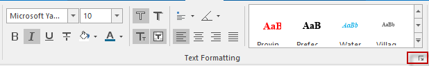
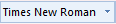

---
id: TextStylegroup
title: Setting Text Styles 
---  

You can set the style for the selected text through the **Styles tab** or **Layer Style **panel. The text style can be set only when there is at least one text object selected in the currently editable text layer.

###  Styles tab

All features in the "Text Style" group under the "Styles" tab are used for setting styles of texts and can be available only when there is at least one text object selected in an editable layer.

  
Figure: Text Formatting Group  
  
You can change text styles through setting related parameters.

### Controls organized in the Text Formatting group:

  *  Change the font face. You can directly type in the text box or select from the dropdown list. In the dropdown list, you can type a letter to quickly locate fonts beginning with the letter. 
  *  Change the font size. 
  *  is used to make the selected text bold. 
  *  is used to italicize the selected text. 
  *  is used to outline the selected text. When this button is highlighted, the  button will become available for you to specify the outline color. You can not outline the text with a background effect.
  *  is used to underline the selected text. 
  *  is used to draw a line through the middle of the selected text. 
  *  is used to add shadow effects to the selected text. When this button is highlighted, the  button will become available for you to specify the shadow color. 
  *  is used to fix the size of the selected text. When this button is highlighted, the size of the selected text will not change when you zoom in or out of the window. 
  *  is used to add background effects to the selected text. When this button is highlighted, the  button will become available for you to specify the background color. You can not specify a background color for the outlined text. 
  *  is used to change the text color. Click the button to display the color panel, in which you can directly select a color or click More Colors at the bottom to define one.
  *  is used to specify the rotation angle for the selected text. You can click the button, and then type an angle in the text box or tune the spinner to the right of the text box to change the rotation angle of the text.
  *  is used to align the selected text. The available 12 options are: Top Left, Top Center, Top Right, Left Baseline, Center Baseline, Right Baseline, Bottom Left, Bottom Center, Bottom Right, Left Center, Center, and Right Center. You can select an alignment mode from the drop-down list.
  *  is used to set how to align text objects Four alignments are provided: left-aligned text, centered text, .right-aligned text, justified text for you to select. 
  * **Text template** : In the Gallery on the "Text Style" group, some common templates are provided. You can select any one of them to apply to the selected texts. 
  * **Text Style Template** : Click the dialog button in the "Text Style" group to open the "Text Style Template" panel. A variety of templates are listed in the panel, and you can click "Templates Manager" dialog box to manage all templates.

###  Layer Style panel

Right click the text object you want to modify in your text layer, and then select "Object Style" and the "Layer Style" appears. In the panel, you can view all parameters relative to the selected text object, if your layer is editable, you can reset its parameters. Features in the panel is coincident with those in the Text tab in the Properties. So for detail descriptions, please refer to [Text properties window - Text](../Interaction/TextPropertyDia.htm).
  
### Note

  1. If you have selected multiple types of objects like text objects, geometry objects, etc. in different layers, the Text Formatting group will only be usable if you have the text layer above other layers with selected objects.