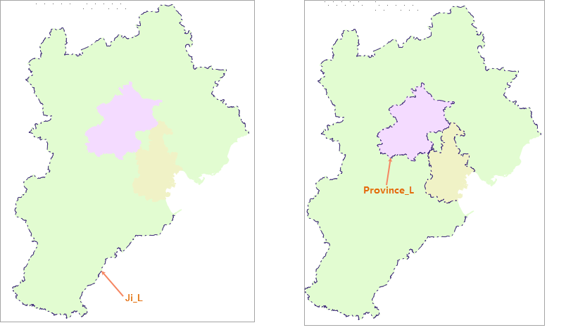

This document introduces an example for outputting and loading layer properties. In more detail, this document introduces how to output the properties information of a layer into template, and then apply the template to another layer.

The example includes layer property setting, output layer properties template and load layer properties template. Take JingJinJi.smwu sample data as an example to introduce how to use layer templates.

### Basic Steps

  1. We set styles for the line layer Ji_L first and save all settings as a template. And then, we set styles for another layer Province_L by loading the template.
  2. Select the line layer Ji_L. Click **Styles Settings** tab > **Line Style** > **Line Symbol**. And then select the linear symbol.
  3. Click the **Color** dropdown button in the **Line Style** group of the **Styles Settings** tab, and set the foreground color to: 83,74,100.
  4. On the Layer Properties panel, set the transparency of the layer to 30%. Meanwhile, set the minimum and maximum visible scales of the layer to 1:20000000 and 1:50000 respectively.
  5. Right-click your layer and select **Layer Property Template** > **Export...**. In the popup dialog box specify the path to save the template and name it Ji_L@JingJinJi.xml.
  6. Open the line dataset Province_L, right click the layer in **Layer Manager** , and select **Layer Property Template** > **Load...**. In the popup dialog box, browse to the folder where the template is saved in and select the template file Ji_L@JingJinJi.xml to apply the layer styles and properties to the layer.
  
