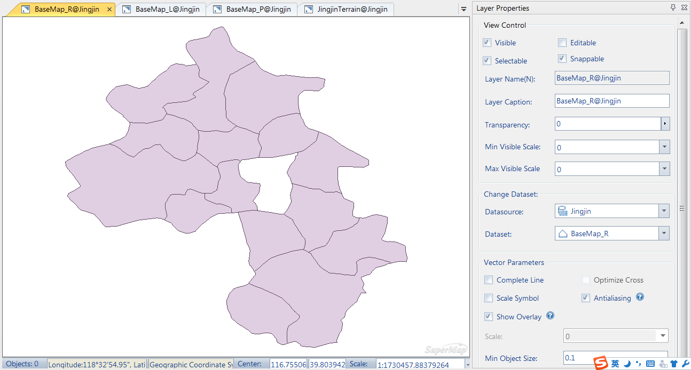
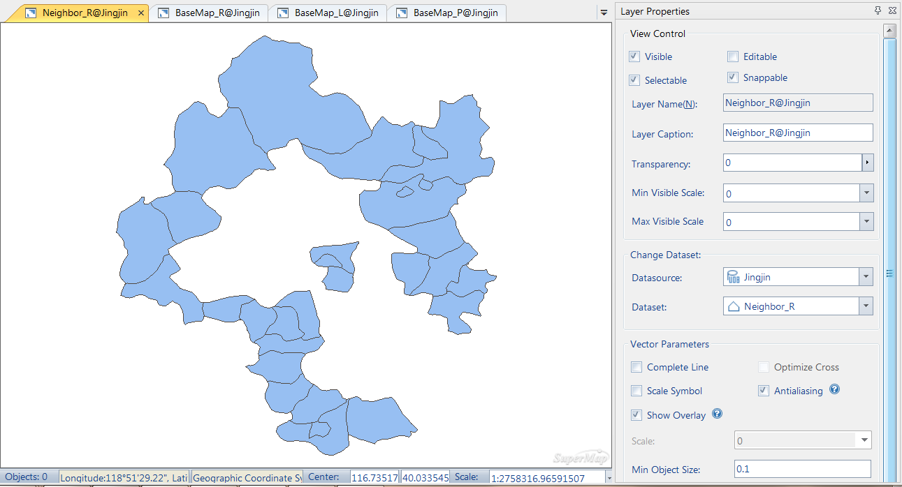

This document introduces an example for outputting and loading layer properties. In more detail, this document introduces how to output the properties information of a layer into template, and then apply the template to another layer.

The example includes layer property setting, output layer properties template and load layer properties template. The Jingjin.smwu sample data is used in this example.

### Basic Steps

  1. Open the BaseMap_R dataset in the map window.
  2. Click the Foreground Color dropdown button in the Fill Styles group of the Styles Settings tab, and set the foreground color to: 253, 234, 218.
  3. Click the Color dropdown button in the Line Styles group of the Styles Settings tab, and set the foreground color to: 79, 150, 113.
  4. On the Layer Properties panel, set the transparency of the layer to 30%. Meanwhile, set the minimum and maximum visible scales of the layer to 1:20000000 and 1:50000 respectively.
  
---  
Figure: Setting Layer Properties  
  5. Select the layer in Layer Manager, right click, select Output... in the Layer Property Template menu, specify the path for placing the template in the Output Template dialog box that displays, save the template as BaseMap_R.xml.
  6. Open the Neighbor_R region dataset in a new map window, right click the layer in Layer Manager, click Load in the Layer Property Template menu, select the BaseMap_R.xml template file to apply layer properties saved in the template to the Neighbor_R layer, as shown below.
  
---  
Figure: Layer with template applied  
