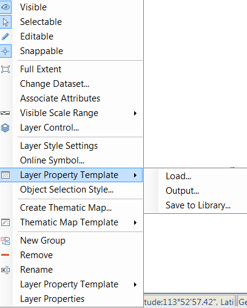

### Introduction

The Load Layer Property Template function can add layer property template stored in the *.xml file, and then applied the layer property information to the current layer.

The layer property template stores layer properties, layer styles, thematic map settings, etc.

### Basic Steps

  1. Right click a layer in the Layer Manager, in the menu that displays, click Layer Property Template, click Load.
  
---  
Figure: Load Layer Property Template  
  2. In the Load Template dialog box that displays, select the Layer Property Template in the *.xml file, click the Open button in the dialog box to load layer property information in the template file to the current layer.
  3. After loading the layer property template, the layer properties that the layer shares with the template layer will be set to the consistent with the template layer.

### Note

  * After loading layer property template, the layer caption will not change.
  * If the dataset corresponding to the current layer is not consistent with the dataset in the property template, the property settings related to dataset fields will not take effect, the dataset field needs to be specified again, such as display filter condition, object display order field, layer association attribute table, etc. 