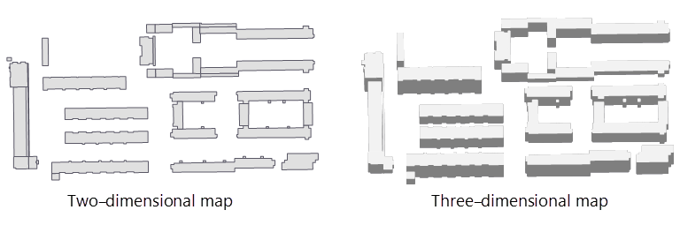
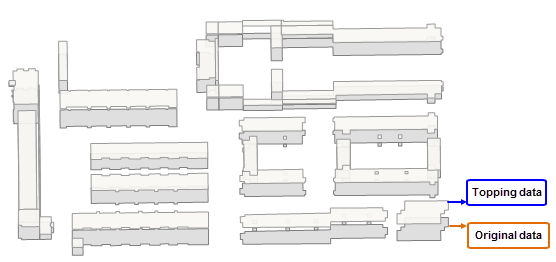
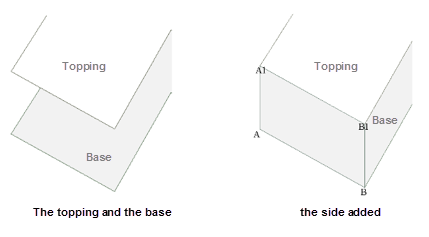
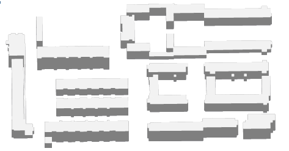

### Instructions

A stereoscopic map varied from a plane map is a map with the sense of volume and can help people identify surface features more easily. A stereoscopic map adds levels of a plane map. You are allowed to set styles of the topping and the shadow of a stereoscopic map to make the map beautiful.

introduces features to make a two-dimensional map have a stereoscopic effect. You are required to specify a field as the height property of the result map to generate its topping and side data.

### Basic steps

1. **Data preparation** : Prepare a vector region dataset for creating a stereoscopic map and the dataset must have a field in integer or double.
2. Click "Data" > "Data Processing" > "Map Making" > "Stereoscopic Map" to open the "Create 3D Map" dialog box.
3. In the Input area, specify your vector region dataset and set the stretching height and the name of result data.
4. Click "OK". The result contains two region dataset, one is the topping dataset and the other one is the side dataset. 
* **The topping dataset**

The topping dataset is generated by moving each original object a certain distance (the height of each object) along the Y axis. The result is what the following picture (the left one) shows, and because of there is no side data, the result does not have the stereoscopic effect. 

* **The side dataset**

Compared to the original data, the topping data has no offset in the X axis and just offsets along the Y axis, and so we connect the first point (the point A in the following picture) of the original data to the first point of the topping data (the point A1 in the following picture) and connect the second point (the point B in the following picture) of the original data to the second point of the topping data (the point B1 in the following picture) and so on to produce the side data. 

5. Add the topping data and the side data into a map and then configure styles of layers to get a stereoscopic map. 

