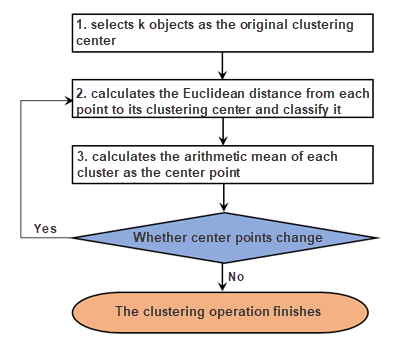
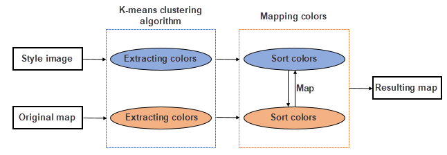
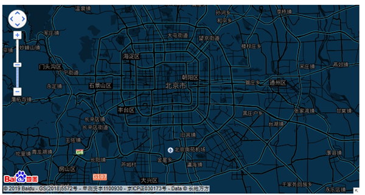
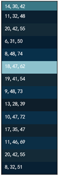
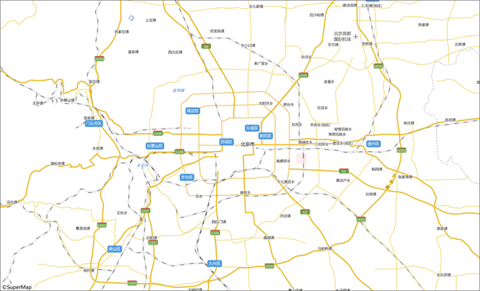
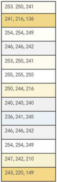
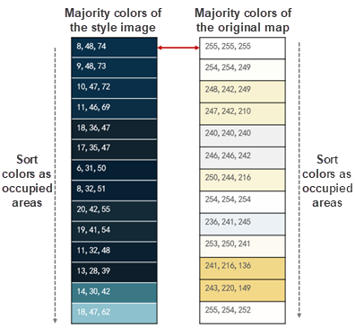
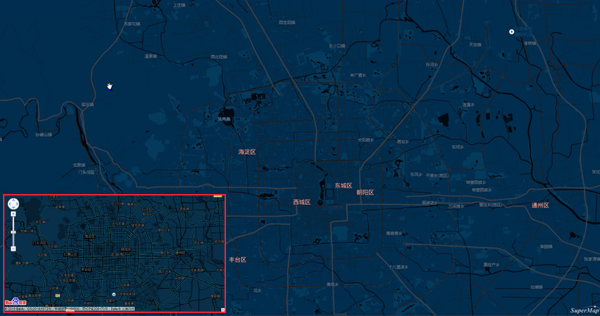

Mapping is the essential feature of every GIS software. The traditional way to create a map is adjusting each symbol, line, color, label, etc. one by one, that is a very time-consuming procedure. AI Mapping allows you to set styles for a map by one click.

Integrating with K-means clustering algorithm, SuperMap iDesktop can transfer the style of a style image you specified to your map.

### **Function Principle**

**K-means Clustering Algorithm**

K-means clustering algorithm selects k objects randomly as the original
cluster centers and computes the distance (iDesktop uses Euclidean distance of pixels of RGB pictures) between each object and each cluster center, then
classifying objects.

The basic procedure of the algorithm is as follows:

1. Produces k cluster centers randomly (or specified by user).
2. Computes the distance from each sample to each cluster center, and classifying features.
3. Calculates the arithmetic mean of each sample and then take the point, that is close to the arithmetic mean, in each classification, as the new center. 
4. Checks whether no center points of classifications change. If some center points change, the algorithm will cluster data again around new center points until all center points are fixed.

**The theory of AI Mapping**

The feature extracts the key color tables from both your style image and your
map. Then searches each layer's color in the map color table and replace it
with the corresponding color in the image color table, thereby creating a new map similar to your image in style.

**Step 1: extracting a key color table from the style image**

The feature can learn from image data based on the K-mean clustering algorithm
and extract majority colors from the style image. As the following picture
shows, the feature extracted the majority colors from the Baidu map template
that we specified as the style image.

 | 
---|---
The Baidu map template | Majority colors

**Step 2: Extract majority colors from the map**

The feature will extract majority colors from the map that you want to modify.
The program will output the map as a picture first to improve the accuracy of
extracted colors. As the following picture shows, the feature extracted the
majority colors from the light-color map.

 | 
---|---
The original map | Key colors extracted from the map

**Step 3: Map colors**

After extracting colors, the feature will map the image color table and the
map color table as the area that each color occupied. And then, search each
layer's color in the layer color table with the corresponding color in the
image color table. As the following picture shows, the feature replaced the
color (255,255,255) on the map with the color (8,48,74).

After the procedure, we got the following map.

