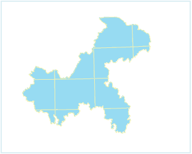
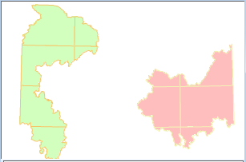
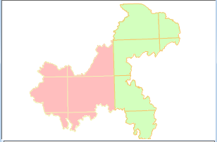

The Dynamic command in the Projection group allows you to specify whether to
project different data in a map on the fly to make them display in the same
projection.

The Dynamic Project on the Coordinate tab is used to control the layers in map
to display in same projection through dynamic projection.

Data on an area is stored in two datasets using different projections. When
adding them to the same map window, the region is torn apart, that does not
match the real situation.

  
  
When you add two different data to the same map window, the Coordinate System
Reminder dialog box pops up, and you can click the Yes button in the dialog
box to automatically turn on the dynamic projection.

If you check the Dynamic Projection box, the two datasets are displayed in the
map window using a uniform projection. The following pictures show the display
effect.

 |   
---|---  
Before dynamically projecting | After dynamically projecting  
  
After turning on the dynamic projection, you still can set projection
transformation parameters. You can click **Transform Parameter** to open
**Parameter Settings** dialog box to set related parameters. For more
description about projection transform parameters, please refer to [Projection
Transformation](../../DataProcessing/Projection/ConvertPrjCoordSysSingle).

### Note

Web Map (including OGC, SuperMap Cloud Service and Google maps etc.), image
maps and map cache type don't support dynamic projection.
